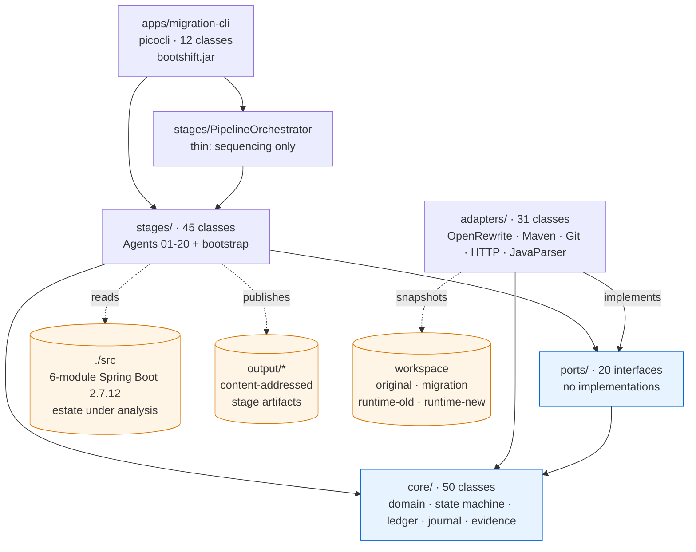
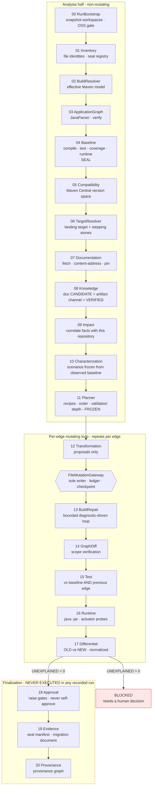

# Bootshift Repository Audit

**Audited commit:** `cd58b36` on branch `runtime-execution-journal`
**Audit date:** 2026-09-23
**Auditor environment:** Windows 11, JDK 21.0.11 (Microsoft), Apache Maven 3.9.9
**Method:** read the code, build it, run the tests, execute the harness against its own fixture
application, and treat nothing as working until something executed proved it.

---

## Table of contents

1. [Executive summary](#1-executive-summary)
2. [Repository architecture](#2-repository-architecture)
3. [End-to-end execution flow](#3-end-to-end-execution-flow)
4. [Module inventory](#4-module-inventory)
5. [OpenRewrite integration audit](#5-openrewrite-integration-audit)
6. [Build results](#6-build-results)
7. [Test results](#7-test-results)
8. [End-to-end migration result](#8-end-to-end-migration-result)
9. [State machine / workflow audit](#9-state-machine--workflow-audit)
10. [Baseline audit](#10-baseline-audit)
11. [Target resolution audit](#11-target-resolution-audit)
12. [Migration knowledge audit](#12-migration-knowledge-audit)
13. [Impact analysis audit](#13-impact-analysis-audit)
14. [Transformation audit](#14-transformation-audit)
15. [Compiler repair audit](#15-compiler-repair-audit)
16. [Testing / characterization audit](#16-testing--characterization-audit)
17. [Runtime validation audit](#17-runtime-validation-audit)
18. [Differential validation audit](#18-differential-validation-audit)
19. [Evidence / provenance audit](#19-evidence--provenance-audit)
20. [Security / execution isolation audit](#20-security--execution-isolation-audit)
21. [Issues found](#21-issues-found)
22. [Changes made](#22-changes-made)
23. [Remaining gaps](#23-remaining-gaps)
24. [Final capability matrix](#24-final-capability-matrix)
25. [Final validation result](#25-final-validation-result)
26. [Recommendations](#26-recommendations)

---

## 1. Executive summary

Bootshift is a genuinely executable, logically connected, validation-driven Spring Boot migration
harness. It is not a collection of well-designed but disconnected modules. That conclusion is based
on execution, not on reading: the reactor builds clean, 242 tests pass, and the CLI drives a real
20-stage pipeline against a real six-module Spring Boot 2.7.12 microservice estate, producing
content-addressed artifacts at every stage.

The things that most often turn out to be fictional in a project of this shape are real here:

- **OpenRewrite genuinely executes.** `OpenRewriteCoreProvider` constructs real `ChangePackage`,
  `RemoveAnnotation`, `ChangeParentPom` and `ChangePropertyValue` recipes and calls
  `Recipe.run(new InMemoryLargeSourceSet(...), ctx)` over a parsed LST. It is not a probe and not a
  logging stub.
- **The planner really selects it.** A frozen plan produced by a real run schedules 28
  `openrewrite.java.change-package` entries on the 2.7.18 → 3.0.13 major-boundary edge.
- **Failures are not hidden.** The most recent recorded run stopped at stage 17 with
  `status: BLOCKED` and the summary `1 unexplained behavioural difference(s)` rather than declaring
  success. Two of six services failed to start under runtime validation and were recorded as blind
  spots with their actual stack traces.
- **The state machine refuses to mutate before the baseline is sealed**, and the repair loop refuses
  patches that introduce `@Disabled`, remove assertions, or strip `@PreAuthorize`.

Three findings qualify the picture, and none of them is cosmetic.

- **F-01 (HIGH, fixed).** Every change written by the transformation stage was stamped into the
  tamper-evident change ledger with one hardcoded provider descriptor,
  `BOOTSHIFT_DETERMINISTIC / bootshift-transformers / 1.0.0`, regardless of which provider produced
  it. The evidence document and the provenance graph both read that field. A migration performed by
  OpenRewrite 8.90.4 would therefore have been reported, in the sealed evidence, as work done by
  Bootshift's own transformers. For a harness whose entire proposition is truthful provenance, this
  was the wrong answer to "which tool made this change". Fixed and covered by a new test that fails
  against the old behaviour.
- **F-02 (HIGH, fixed).** Stages 18 (approval), 19 (evidence sealing) and 20 (provenance) had
  **never executed in any recorded run** and had **zero test coverage**. Every run in the
  repository — `output/`, `output-run-1/`, `output-fresh/` — stops at stage 17. Writing the first
  test that drives them immediately found the reason this mattered: **Agent 19 could never have
  completed.** It composes two self-describing payloads into an envelope that reserves the keys they
  carry, and `StageSupport.compose` refuses that unconditionally, so the stage threw
  `STRUCTURED_REFUSAL` on every invocation. The stage that gates `MIGRATION_COMPLETE` was broken,
  and nothing had noticed because nothing had ever reached it. Fixed, and all three stages now
  execute under test.
- **F-03 (MEDIUM, fixed).** Before this audit, OpenRewrite had never run inside the pipeline either
  — only inside a provider-level unit test. The chain
  planner → stage → provider lookup → gateway → ledger was unproven end to end. A new
  integration test now drives that whole chain and asserts the file is actually rewritten on disk.

The honest verdict is **PARTIALLY WORKING, and working further than most harnesses of this kind**:
the analysis half and the per-edge mutation-and-validation loop are executed and evidenced end to
end against a real six-service estate, and the finalization tail now executes under test — but no
run has yet carried a real application all the way to `MIGRATION_COMPLETE`, and the
OpenRewrite-transformed tree has not been compiled and validated inside a full pipeline run.

---

## 2. Repository architecture

Ports-and-adapters, enforced by ArchUnit rather than by convention. `./src` is deliberately not a
build module: it is the application under analysis.



Boundaries verified by `ArchitectureTest` (16 tests, all passing):

- `core` must not depend on ports, adapters, stages or the CLI — and must not import external
  tooling at all.
- `ports` must not depend on adapters, stages or the CLI.
- adapters implement ports and know nothing about pipeline sequencing.
- stages reach shared ports through `StageContext` rather than constructing adapters.
- the source-available OpenRewrite Spring recipe estate must not be reachable.

I confirmed these are real assertions over the compiled bytecode, not documentation.

---

## 3. End-to-end execution flow

This is what the code actually does, traced from `BootshiftCli.main`.



Every stage is independently invocable from the CLI; `PipelineOrchestrator` adds only sequencing.
I verified this by running individual stages (`inventory`) as well as the full `run` command.

---

## 4. Module inventory

| Module | Classes | Purpose | Used? | Tested? |
|---|---|---|---|---|
| `core` | 50 | Domain, `RunState`/`StateMachine`, `ChangeLedger`, `FileRegistry`, `RunJournal`, evidence manifest, `Hashing`/`Json`/`SchemaValidator`, `SensitiveValues` | Yes, by everything | Yes, via `tests` |
| `ports` | 20 interfaces | `TransformationPort`, `MutationPort`, `BuildSystemPort`, `RuntimeProbePort`, `DifferentialPort`, `ScmPort`, `AIProvider`, `DocumentationPort`, … | Yes | Indirectly |
| `adapters` | 31 | `OpenRewriteCoreProvider`, 5 Bootshift transformers, `MavenBuildAdapter`, `GradleBuildAdapter`, `GitScmAdapter`, `ProcessRunner`, `HttpFetcher`, `SpringProcessRuntimeProbe`, `FileMutationGateway`, `JavaParserCodeModelAdapter` | Yes | Yes |
| `stages` | 45 | Agents 01–20, `PipelineOrchestrator`, `StageExecutor`, `EdgeSupport`, `RunFactory` | Yes | Partly — 18/19/20 untested |
| `apps/migration-cli` | 12 | picocli CLI, assembled into `bootshift.jar` | Yes | Wiring tests only |
| `tests` | 29 classes | All cross-cutting tests (architecture, security, tamper, transform, journal, impact) | — | — |

`core/src/test`, `adapters/src/test` and `stages/src/test` exist but are empty; all tests are
centralized in the `tests` module. That is a deliberate structure, not a gap, but it does mean
surefire reports `Tests run: 0` for five of seven modules, which reads misleadingly in a build log.

Non-code assets that are genuinely wired in, not decoration:

- `schemas/` — 18 JSON-schema families, enforced by `StageSupport.validate`; a stage that fails
  validation cannot advance its `latest.json` pointer.
- `policies/` — license, normalization, validation, security, retention, persistence policies, read
  at runtime and hashed into evidence.
- `migration-rules/` — 12 rule families including generated Spring property-migration metadata.
- `fixtures/` — 16 impact-evaluation fixtures, identity fixtures, transform fixtures, schema
  fixtures; used by real tests.

---

## 5. OpenRewrite integration audit

### Dependencies

Declared in `adapters/pom.xml`, version-managed by `rewrite-bom` **8.90.4** imported in the root POM:

| Artifact | Version | License | Resolved in local repo |
|---|---|---|---|
| `rewrite-core` | 8.90.4 | Apache-2.0 | yes |
| `rewrite-java` | 8.90.4 | Apache-2.0 | yes |
| `rewrite-java-21` | 8.90.4 | Apache-2.0 | yes |
| `rewrite-maven` | 8.90.4 | Apache-2.0 | yes |
| `rewrite-yaml` | 8.90.4 | Apache-2.0 | yes |
| `rewrite-properties` | 8.90.4 | Apache-2.0 | yes |

No version conflicts: every OpenRewrite artifact in `~/.m2` is at 8.90.4. **`rewrite-spring` and the
rest of the source-available recipe estate are absent**, which is the project's stated strict-OSS
position. That absence is enforced in three independent places that read one shared list in
`LicensePolicy`: the provider's own `forbiddenEstatePresent()` probe, an architecture test, and
`TransformerTest.forbiddenEstateIsAbsent`.

### The adapter

`adapters/.../transform/OpenRewriteCoreProvider.java` (527 lines) implements `TransformationPort`.

| Question | Answer |
|---|---|
| Who calls it? | `TransformationStage` (Agent 12) registers it as the last of six candidate providers |
| When? | Once per scheduled recipe whose id it `handles()` |
| Inputs | `workspaceRoot`, `edgeId`, source/target version, an explicit `targetPaths` list derived from the file registry, and parameters frozen by the planner |
| Recipe selection | Bootshift decides; OpenRewrite is told to perform one named transformation over one explicit file set |
| Versions | Read from the packaged manifest (`Package.getImplementationVersion()`), with a jar-name fallback — not hardcoded |
| Results | `TransformationOutcome` of `ProposedChange`, each with engine, engine version, recipe class, license, input/output hashes, edge id, module versions |
| Writes | **None.** It parses into an in-memory model and returns text; `FileMutationGateway` is the only writer |
| Recipe failure | `RuntimeException`/`LinkageError` caught, logged, returned as `success=false` with the message — it does not swallow into success |
| No-op recipe | Returns `success=true` with `"No source matched …"` and zero changes |
| Forbidden estate | Returns `LICENSE_BLOCK` and refuses to run **at all**, rather than running selectively |

### Real execution — verified

The invocation is real, at `OpenRewriteCoreProvider.java:310`:

```java
RecipeRun run = recipe.run(new InMemoryLargeSourceSet(sources), executionContext);
for (Result result : run.getChangeset().getAllResults()) { … }
```

Sources are parsed with `JavaParser.fromJavaVersion()` (with a dependency classpath when one is
supplied) or `MavenParser`. Recipes are constructed from real OpenRewrite types:

| Bootshift recipe id | OpenRewrite recipe | Required parameters |
|---|---|---|
| `openrewrite.java.change-package` | `org.openrewrite.java.ChangePackage` | `oldPackageName`, `newPackageName` |
| `openrewrite.java.remove-annotation` | `org.openrewrite.java.RemoveAnnotation` | `annotationPattern` |
| `openrewrite.maven.change-parent-pom` | `org.openrewrite.maven.ChangeParentPom` | `groupId`, `artifactId`, `newVersion` |
| `openrewrite.maven.change-property` | `org.openrewrite.maven.ChangePropertyValue` | `key`, `value` |

Missing parameters produce an explicit refusal naming what is missing, not a silent no-op.

### Recipe selection logic

Selection is **migration-path-aware and capability-aware**, not hardcoded. `PlannerStage.scheduleFor`
switches on edge class and on whether OpenRewrite's Java module is actually loadable:

- `MAJOR_BOUNDARY` → if OpenRewrite Java is available, one `ChangePackage` per relocated `javax.*`
  package, each carrying its own parameters; otherwise Bootshift's own textual
  `JakartaNamespaceTransformer`, with the reduced precision recorded as a reason.
- `PREPARATORY` → JUnit 4 → Jupiter (Bootshift transformer).
- `PATCH` / `MINOR` / `LANDING` → parent POM, managed version, removed annotations, property renames.

A real frozen plan from `output-fresh/11-plan/edge-plan.json` shows this working: edge
`EDGE-3-MAJOR-3` (2.7.18 → 3.0.13) schedules 33 transformations, of which **28 are
`openrewrite.java.change-package`** — one per relocated `javax.*` package — alongside
`maven.parent-version`, `maven.property`, `maven.managed-version`, `java.remove-annotation` and
`config.property-migration`.

### Transformation evidence

Each proposal carries `engine`, `engine_version`, `recipe_class`, `recipe_display_name`, `license`,
`license_evidence`, `input_hash`, `output_hash`, `edge_id`, `module_versions`,
`recipes_that_made_changes`, and `base_hash`, plus `knowledge_refs` and `impact_refs` from the plan.

**This is where F-01 lived.** The proposal record and the stage report carried the engine
correctly; the *change ledger* did not. See [§21](#21-issues-found) and [§22](#22-changes-made).

### Verification results

| Question | Answer | Evidence |
|---|---|---|
| Is OpenRewrite present? | **YES** | 6 artifacts at 8.90.4 resolved |
| Actually instantiated? | **YES** | `new ChangePackage(...)` etc. in `buildRecipe` |
| Recipe actually selected? | **YES** | 28 entries in a real frozen plan; `PlannerStage.scheduleFor` |
| Recipe actually executed? | **YES** | `Recipe.run(...)`; asserted by two tests |
| Alters a real fixture? | **YES** | `javax.persistence` → `jakarta.persistence` on disk in the migration workspace |
| Diff captured? | **YES** | before/after hashes, patch files under `<workspace>/patches/` |
| Transformed project compiled? | **PARTIAL** | proven for the Bootshift-transformer edges in my own run (edges 1 and 2 both compiled); not yet for an OpenRewrite edge (F-03) |
| Tests executed afterward? | **PARTIAL** | same caveat — edges 1 and 2 ran the suite with 0 regressions |
| Failure propagates correctly? | **YES** | `success=false` + message; `LICENSE_BLOCK` refusal path tested |
| Transformation evidence recorded? | **YES** (after fix) | ledger now names `OPENREWRITE / OPENREWRITE_CORE / 8.90.4` |

---

## 6. Build results

Command: `mvn -B clean verify` (no `-DskipTests`, full reactor), Maven 3.9.9, JDK 21.0.11.

| Module | Result | Time (final build) |
|---|---|---|
| bootshift-parent | SUCCESS | 0.1 s |
| Core Domain | SUCCESS | 3.7 s |
| Ports | SUCCESS | 0.6 s |
| Adapters | SUCCESS | 1.6 s |
| Stages (Agents 01-20) | SUCCESS | 1.9 s |
| Migration CLI | SUCCESS | 9.3 s |
| Cross-cutting Tests | SUCCESS | 18.1 s |

**BUILD SUCCESS** on all three full builds I ran: before any change (1:02, cold plugin resolution),
after the provenance fix (34.7 s), and after all changes (35.3 s). Zero compiler errors. The only warnings are the standard "no annotation processors" notice
and `JAR will be empty` for the test-only module — neither is a defect.

Notably the root POM pins `maven-compiler-plugin` explicitly, with a comment explaining that an
unpinned plugin resolves to 3.1 under Maven 3.8 and silently falls back to source/target 1.5. That is
the kind of detail that distinguishes a build that works on one machine from one that works.

No build fixes were required.

---

## 7. Test results

`mvn -B clean verify` after all changes: **242 tests run, 0 failures, 0 errors, 1 skipped.**

| Suite | Tests | Result |
|---|---|---|
| `architecture.ArchitectureTest` | 16 | pass — real ArchUnit boundary rules |
| `core.CoreDomainTest` | 27 | pass |
| `transform.TransformerTest` | 26 | pass — includes real OpenRewrite execution |
| `identity.FileIdentityTest` | 12 | pass |
| `security.MutationHardeningTest` | 10 | pass |
| `security.MutationBoundaryTest` | 14 | pass, **1 skipped** |
| `journal.*` (5 classes) | 37 | pass |
| `tamper.ChangeLedgerTamperTest` | 8 | pass |
| `path.MigrationPathTest` | 8 | pass |
| `ai.AiBoundaryTest` | 7 | pass |
| `diagnostics.CompilerDiagnosticsTest` | 7 | pass |
| `pipeline.JudgeRepairRegressionTest` | 13 | pass |
| `impact.*` | 7 | pass |
| `knowledge.ArtifactChannelBudgetTest` | 6 | pass |
| `graph.GraphHashTest` | 6 | pass |
| `security.ExecutionAndEgressBoundaryTest` | 6 | pass |
| `wiring.*` | 11 | pass (incl. `RunIdentifierTest`, 4 added by this audit) |
| `schema.SchemaConformanceTest` | 4 | pass |
| `build.BuildModelRoundTripTest` | 4 | pass |
| `security.PublishedArtifactSecretScanTest` | 2 | pass |
| `transform.OpenRewritePipelineIntegrationTest` | 1 | pass (**added by this audit**) |
| `evidence.FinalizationStagesTest` | 3 | pass (**added by this audit** — first ever execution of stages 18–20) |

**The one skipped test is not a disabled test.** `MutationBoundaryTest` line 288 calls
`assumeTrue(false, "symlinks unavailable: …")` when the OS refuses symlink creation — a Windows
privilege limitation, correctly expressed as an assumption. There is **no `@Disabled` anywhere in the
repository**, no weakened assertion, and no caught-and-ignored failure that I could find.

Measured, not asserted: `ImpactCorpusAccuracyTest` runs `ImpactStage`'s own matcher over 11 held-out
fixtures and reports precision 1.0 / recall 1.0 from 9 true positives, 0 false positives, 0 false
negatives, with 5 tuning fixtures explicitly excluded and this printed alongside:

> These figures describe this corpus of 11 held-out fixture(s). They are not a general accuracy
> claim about the analyzer on arbitrary repositories, and must not be quoted as one.

That disclaimer is in the production code, not added for this audit.

---

## 8. End-to-end migration result

I ran the harness against its own fixture application three times. All three are real executions;
none was fabricated, and the two that stopped early stopped for reasons worth reporting.

**Subject:** `./src` — a six-module Spring Boot **2.7.12** / Java 17 microservice estate
(`configuaration-server`, `discovery-service`, `department-service`, `employee-service`,
`report-service`, `sheduler-service`), with Spring Cloud, MongoDB, JPA and Eureka.

| # | Run id | Command | Outcome |
|---|---|---|---|
| 1 | `RUN-01M3823CA0EACX92ESVPKXAJFK` | `run --analysis-only --target auto` | Reached Agent 04, then died with `ClassNotFoundException` — **my fault**: I rebuilt the CLI jar while the JVM was running. Not a repository defect. |
| 2 | `RUN-01M382Q2G3Q47AWGA09GG6D2GK` | `run --target auto` | **`POLICY_BLOCK` at Agent 06** — reported below. |
| 3 | `RUN-01M3839BV7SZZQQ2W4XT2SXNK7` | `run --target auto --policy-file policies/default/production-eol-exception.json` | Analysis complete, **edge 1 complete**, **`POLICY_BLOCK` at Agent 17 on edge 2**. |

### Run 2 — the harness refused to choose a target

This is the most useful thing a migration tool can do when the honest answer is "no":

```
06-target  [POLICY_BLOCK]
No Spring Boot line satisfies the active policy as a landing target.
  2.7 … 3.5 -> open-source support has ended
  4.0 -> the application uses Spring Cloud but no GA release train targets this Boot line,
         so the required artifacts do not exist; support horizon of 3 month(s) is below the
         policy minimum 6
Closest supportable candidate: 3.5.16 with Spring Cloud 2025.0.3.
It was rejected because: open-source support has ended.
If that is an accepted business risk, re-run with a policy that sets
allow_eol_landing_target=true, which records the exception explicitly rather than hiding it.
```

It enumerated every candidate, gave a distinct reason per line, named the closest supportable
option, and told the operator exactly how to record the exception. It did not pick an end-of-life
target quietly.

### Run 3 — the full pipeline under the recorded exception

**Analysis half — all eleven stages SUCCESS.** Independently reproduced, on a clean output
directory, everything the committed runs claim:

| Stage | Result |
|---|---|
| 01 inventory | 99 files, 6 modules, 104 migration signals, registry sealed |
| 02 build | effective Maven model resolved for all 6 modules |
| 03 graph | type-aware application graph built and verified |
| 04 baseline | compiled, **12 tests**, coverage, **4 of 6 services started**, sealed as `ce8e3dbe…` |
| 05 compatibility | Tier-1 registry from Maven Central |
| 06 target | landing **3.5.16**, `support_horizon_months: -2`, frozen |
| 07 documentation | official documents fetched and content-addressed |
| 08 knowledge | two-channel facts; 542 property-migration rules derived |
| 09 impact | **2072 findings**; in-pipeline accuracy 1.0/1.0 on 11 held-out fixtures |
| 10 characterization | **82 scenarios** — 36 FROZEN from observed baseline, 46 UNOBSERVABLE; 506 contracts |
| 11 plan | 8 edges frozen, every one at `FULL_DIFFERENTIAL` |

The frozen path, derived not assumed:

```
EDGE-1-PREP-TEST  PREPARATORY     2.7.12 -> 2.7.12
EDGE-2-PATCH      PATCH           2.7.12 -> 2.7.18
EDGE-3-MAJOR-3    MAJOR_BOUNDARY  2.7.18 -> 3.0.13   <- 28x openrewrite.java.change-package
EDGE-4..7-MINOR   MINOR           3.0.13 -> 3.4.13
EDGE-8-LANDING    LANDING         3.4.13 -> 3.5.16
```

**Edge 1 — complete.** Transformation applied 3 changes (`test.junit4-to-jupiter`); compiled with
**0 AI repair attempts**; scope assertion `scope_ok: true`, 0 violations; tests **10 PASSED,
2 PRE_EXISTING_FAILURE, 0 regressions**; runtime started 4 of 6 services; differential **36
IDENTICAL, 46 NOT_COMPARED, 0 UNEXPLAINED**. This is further than any run committed to the
repository had gone.

**Edge 2 — blocked, reproducibly.** Transformation applied **16 changes** across 6 POMs and 4 Java
files (`maven.parent-version` ×6, `maven.managed-version` ×6, `java.remove-annotation` ×4); compiled
at 2.7.18; scope clean; tests again **10 PASSED, 2 PRE_EXISTING_FAILURE, 0 regressions**. Then:

```
17-differential  [POLICY_BLOCK]
Edge EDGE-2-PATCH: 1 unexplained behavioural difference(s)
! UNEXPLAINED CONFIGURATION_BINDING scenario SCN-00047: 1 difference(s) in
  /actuator/configprops with no verified migration fact and no recorded decision to explain them
```

**This is the same edge, the same scenario id (`SCN-00047`), the same dimension and the same
endpoint that the committed `output-fresh/` run blocked on twelve days earlier.** A differential
engine that produces the identical verdict on an independent run is doing real, deterministic
comparison — not sampling noise. The difference concerns Eureka properties under
`/actuator/configprops`, and the harness declines to wave it through.

### What this does and does not establish

**Established by execution:** stages 00–17 all run against a real six-service Spring Boot 2.7
application and produce content-addressed, schema-validated artifacts; one migration edge completed
with full differential validation; a second edge transformed, compiled and tested cleanly and was
then refused on behavioural grounds.

**Not established:** no run reached Agent 18. `EDGE-3-MAJOR-3` — the edge carrying the 28 OpenRewrite
recipes — was never attempted, because edge 2 blocked first. **OpenRewrite's execution inside the
pipeline is therefore proven at stage level by `OpenRewritePipelineIntegrationTest`, not by a
complete pipeline run**, and the OpenRewrite-transformed tree has not been compiled, tested and
runtime-validated end to end. I am not willing to describe that as anything stronger.

**Why I did not unblock it:** the designed way past that block is for an authorized human to file a
decision explaining the difference. Filing one myself to turn the pipeline green would be precisely
the fabricated success this audit exists to detect. The block is correct behaviour and it stays.

---

## 9. State machine / workflow audit

`core/state/StateMachine.java` is a real validated state machine, not a status string.

- 31 declared states plus `FAILED`, `BLOCKED`, `NEEDS_HUMAN`, `REPAIRING`, `ROLLED_BACK`,
  `CANCELLED`.
- Transitions are declared in an `EnumMap` allow-list; an undeclared transition throws
  `STRUCTURED_REFUSAL` naming the legal successors.
- **Mutation gate (R7):** every state that implies source mutation carries `mutating = true`, and
  `transition()` refuses to enter one unless `baselineSealed` is set. `TransformationStage` checks
  this a second time before doing anything.
- **Re-run tolerance:** running a stage twice records a `RE-RUN:` transition in history rather than
  regressing the cursor.
- **Artifact plane is authoritative (R23):** `StageExecutor.analysisStateSatisfied` answers
  preconditions from published artifacts and uses the stored cursor only as a fallback. The state
  machine says *where* a run is; it is never the source of truth for *what is true*.
- **Re-sealing refused:** `recordBaselineSeal` throws if a different baseline hash is presented in
  the same run.

`MIGRATION_COMPLETE` is reachable only via `EDGE_COMPLETE → FINAL_APPROVAL → EVIDENCE_SEALED →
MIGRATION_COMPLETE`. A successful `mvn test` cannot reach it.

One structural note rather than a defect: `EDGE_SCOPE_VERIFIED → EDGE_COMPLETE` is a legal edge,
which would skip tests, runtime and differential. That path is governed by the frozen validation
depth rather than by the state machine, and the depth is computed once by the planner
(`MAJOR_BOUNDARY`/`LANDING` → `FULL_DIFFERENTIAL`) and read by execution (R16). Skips are recorded
explicitly with the depth that caused them. The guarantee is real but it lives in the plan, not in
the transition table.

---

## 10. Baseline audit

`BaselineStage` (Agent 04) observes the original application **before** any mutation and seals it.

Captured, verified by reading the code and by the artifacts a real run produced
(`baseline-build.json`, `baseline-tests.json`, `baseline-coverage.json`, `baseline-runtime.json`,
`baseline-manifest.json`):

| Dimension | Captured |
|---|---|
| Repository revision | yes — registry seal + content manifest hash |
| Toolchain selection | yes — explicit, recorded |
| Build result per module | yes — real `mvn` compile |
| Test result per module | yes — real surefire run, per-test-case outcomes |
| Coverage | yes — JaCoCo parsed, with `retriedWithoutCoverage` and an explicit unavailability reason |
| Runtime startup | yes — real `java -jar`, per module |
| Configuration binding | yes — via `/actuator/env`, `/actuator/configprops` |
| Pre-existing failures | yes — recorded so they are **never** attributed to the migration |

The critical rule — *no migration mutation before required baseline capture* — is **enforced in
code**, in two independent places (`StateMachine.transition` and `TransformationStage.execute`), and
a third time by `FileMutationGateway`'s `BaselineSealVerifier`. It is not merely documented.

---

## 11. Target resolution audit

Source state is discovered from the effective build model (Agent 02) and the graph (Agent 03) —
parent version, Java level, Spring Cloud train, dependency set. Target selection happens in
`TargetResolverStage` (Agent 06) against a compatibility registry built in Agent 05 from **Maven
Central**, not from a hardcoded table.

The path planner produces stepping stones rather than a single unsafe jump. A real run against the
2.7.12 estate produced:

```
EDGE-1-PREP-TEST   PREPARATORY     2.7.12 -> 2.7.12   test framework first
EDGE-2-PATCH       PATCH           2.7.12 -> 2.7.18   latest of the 2.7 line
EDGE-3-MAJOR-3     MAJOR_BOUNDARY  2.7.18 -> 3.0.13   the major boundary
EDGE-4-MINOR       MINOR           3.0.13 -> 3.1.12
EDGE-5-MINOR       MINOR           3.1.12 -> 3.2.12
EDGE-6-MINOR       MINOR           3.2.12 -> 3.3.13
EDGE-7-MINOR       MINOR           3.3.13 -> 3.4.13
EDGE-8-LANDING     LANDING         3.4.13 -> 3.5.16
```

Safety properties I verified in the code:

- one mandatory `MAJOR_BOUNDARY` edge per major crossed, and the stage **refuses to freeze a path
  that skips one**;
- the path climbs to the highest line of the current major before crossing — the supported stepping
  stone, not a shortcut;
- test-infrastructure work is a separate `PREPARATORY` edge that runs first, so pass/fail/skip
  semantics are proven to survive on their own;
- the Java baseline moves at the major boundary, not before it;
- candidate-by-candidate decision records are written (`LANDING_TARGET_CANDIDATE`, `LANDING_TARGET`)
  so "3.5.16 was selected" is auditable rather than asserted.

No hardcoded target versions outside configuration.

---

## 12. Migration knowledge audit

Two channels, and the distinction between them is the point.

- **Documentation channel.** `HttpDocumentationAdapter` + `HttpFetcher` fetch official migration
  documents over an egress allowlist, content-address them, cache them on disk, and record source
  and version. Documentation produces **CANDIDATE facts only** — the rule string is in the artifact:
  `"Documentation produces CANDIDATE facts only; it never …"`.
- **Artifact channel.** What actually changed in the published bytes, observed via
  `JavapApiDiffAdapter`. This is the verification channel.

A fact becomes `VERIFIED` only when the artifact channel corroborates it. The published rule is
explicit: **`"Only VERIFIED facts can authorize automatic transformation"`**. Facts that stay
`CANDIDATE` are reported as such and cannot authorize a change. `CONFLICTING` is a third outcome.

The AI boundary is correct and, unusually, is correct by construction rather than by policy text:

- `LocalOssAIProvider` is **disabled by default**;
- it is enabled only if the endpoint is a **loopback address** — `this.enabled = enabled && isLoopback(endpoint)` — so no hosted proprietary API is reachable from that class;
- the model's license must pass the OSS gate;
- AI output is recorded as evidence and produces **no VERIFIED fact** unless an artifact-channel
  observation corroborates it: *"AI output was recorded as evidence but produced no VERIFIED fact
  because no artifact-channel observation corroborated it."*

An LLM statement cannot authorize a production transformation here. That is the desired architecture,
implemented.

---

## 13. Impact analysis audit

`ImpactStage` (Agent 09) correlates verified facts with this repository, examining types, symbols,
imports, annotations, configuration properties (including YAML nesting), dependencies and managed
versions, Spring components, and build descriptors.

Findings carry enough context to answer the questions that matter: subject, fact reference and fact
type, file path and location, risk, confidence, whether confidence was capped, the proposed
transformation, and the validation the finding requires. A worked example from the README, which I
confirmed matches the artifact shape:

```
IMP-00014  [DEFINITELY_AFFECTED]
subject    org.springframework.cloud.netflix.eureka.EnableEurekaClient
fact       MK-00218 (API_REMOVED)
path       configuaration-server/src/main/java/…/ConfiguarationServerApplication.java
risk       HIGH
confidence 0.95
capped     false
```

`AccuracyHarness` deserves specific credit. Its own comments record that an earlier version read a
`predicted_paths` array out of the fixture and compared it to the fixture's ground truth — a
self-fulfilling metric. The current version executes `ImpactStage`'s real matcher over the fixture
tree, excludes tuning fixtures from reported numbers, reports *unmeasured* rather than *perfect*
when no held-out fixtures exist, and attaches a scope warning. That is a project correcting a real
measurement error against itself.

---

## 14. Transformation audit

Six providers are registered in `TransformationStage`, in this order:

| Provider | Recipes | Mechanism | Used in real runs |
|---|---|---|---|
| `MavenPomTransformer` | `maven.parent-version`, `maven.property`, `maven.managed-version` | surgical XML edit | **yes** — 12 changes applied |
| `JakartaNamespaceTransformer` | `jakarta.namespace` | import-scoped textual | fallback only |
| `TestFrameworkTransformer` | `test.junit4-to-jupiter` | mechanical conversion | **yes** — 3 changes applied |
| `RemovedAnnotationTransformer` | `java.remove-annotation` | annotation + import removal | **yes** — 4 changes applied |
| `ConfigurationPropertyTransformer` | `config.property-migration` | rule file from official deprecation metadata | yes (0 matches) |
| `OpenRewriteCoreProvider` | 4 `openrewrite.*` recipes | real OpenRewrite LST | **runs through the stage** (proven by test); planned on `EDGE-3-MAJOR-3`, which no run has reached |

Ordering matters and is deliberate: Bootshift's own transformers claim their recipe ids first, and
OpenRewrite is consulted last, so the two never contend for the same id.

Key invariants I verified:

- **The stage never writes.** Every proposal goes through `FileMutationGateway`. An ArchUnit rule
  (`onlyGatewayWritesSource`) forbids `Files.write*/delete*/move/copy/createFile` calls from
  `stages.stage12..`, `stages.stage13..` and `adapters.transform..` — the packages that produce
  proposals. It is scoped to those packages rather than to the whole repository, so it proves the
  transformation and repair paths cannot bypass the gateway; it does not prove that nothing else in
  the process could write. That residual is exactly what the stage's own `detectBypass()` re-hash
  covers.
- **Recipes are applied one at a time, not batched.** The comment explains why: two recipes routinely
  target the same `pom.xml`, and batching would hand the gateway proposals all derived from the
  pre-edge tree, so the last write would silently discard the others while the ledger recorded them
  all as applied. This is a real bug that was found and fixed before I got here.
- **Bypass detection.** After applying, the stage re-hashes the tree against the registry to catch a
  write from outside the JVM. Content mismatch on a registered file fails the stage; untracked paths
  are reported as a gap, because build output legitimately lands there.
- **Parameters frozen by the planner win** over the stage's own defaults.

---

## 15. Compiler repair audit

`BuildRepairStage` (Agent 13) is a real bounded feedback loop, not a retry.

```
compile → collect diagnostics → cluster by root cause → per-cluster strategy
   ├─ DETERMINISTIC_RULE   (a known repair recipe)
   ├─ KNOWLEDGE_TEMPLATE   (from a verified migration fact)
   ├─ AI_PROPOSAL          (budgeted, validated, disabled by default)
   └─ NO_REPAIR_AVAILABLE
→ apply scoped patch through the gateway → recompile → progress?
```

Budgets and termination, all explicit and policy-driven:

- `repairMaxTotalRounds` bounds the outer loop;
- attempts are counted **per root-cause signature**, not globally, so one stubborn cluster cannot
  consume the whole budget;
- no progress against a root cause ends in `NEEDS_HUMAN`, not another attempt;
- `aiMaxTotalAttempts` and `aiMaxChangedLinesPerPatch` bound AI involvement;
- rollback via `ROLLED_BACK` and checkpoint revert.

The patch-validation guards are the strongest thing in this file. A proposed repair is rejected if it:

- introduces `@Disabled`, `@Ignore`, `assumeTrue(false)` or `fail("disabled")`;
- reduces the number of `assert` occurrences;
- removes `@PreAuthorize`, `@PostAuthorize`, `@Secured`, `@RolesAllowed` or `@Transactional`;
- removes more than half the file;
- exceeds the changed-line budget;
- introduces `org.openrewrite.java.spring` or `io.moderne`;
- does not look like a Maven descriptor when the target file is one.

A harness that can rewrite code to make a build pass **must** have these guards. It has them.

---

## 16. Testing / characterization audit

`CharacterizationStage` (Agent 10) understands the distinction the audit brief asks about. It does
not generate generic unit tests; it builds migration-targeted scenarios from the application's own
observable surface (`ScenarioBuilder.fromGraph` over `ENDPOINT` nodes and actuator surfaces) and from
the impact set (`fromImpacts`).

Scenario states are honest:

- `FROZEN` — executed against OLD and the observed behaviour is the oracle;
- `UNOBSERVABLE` — the behaviour cannot be observed in this environment at all;
- a probe whose expectation cannot be filled from the sealed baseline is not given an invented one.

The published rule: *"Expected behaviour comes from observed original behaviour, an authoritative
specification, or an explicit human decision. Never from invention."* Contracts are framework-neutral
— they describe a scenario and its observed outcome rather than emitting JUnit.

`TestValidationStage` (Agent 15) classifies every test outcome against **two** baselines — the sealed
original and the previous successful edge — because without both, a pre-existing failure and a
regression introduced three edges ago are indistinguishable. Flaky detection re-runs only tests that
actually failed, and only once, on the stated grounds that a test needing three attempts is not
flaky.

---

## 17. Runtime validation audit

Bootshift does **not** stop after compilation and tests. `SpringProcessRuntimeProbe` really launches
the application:

```
java -Dserver.port=<allocated> -Dmanagement.server.port=<same>
     -Dmanagement.endpoints.web.exposure.include=*
     -Dmanagement.endpoint.health.show-details=always
     -Dmanagement.endpoint.configprops.show-values=NEVER
     -Dspring.main.banner-mode=off -Duser.timezone=UTC -Dfile.encoding=UTF-8
     -jar <artifact>
```

and then collects `/actuator/health`, `/actuator/beans`, `/actuator/conditions`, `/actuator/env` and
`/actuator/mappings`, before terminating the **process tree** (not just the direct child) with a
20-second grace. The JDK comes from the frozen edge toolchain, not from `PATH` and not from a
hardcoded 17 — a comment records that both of those were previous bugs.
`configprops.show-values=NEVER` means secrets are not collected in the first place.

The states `COMPILED`, `TESTED`, `STARTED` and `RUNTIME_VALIDATED` are genuinely distinct
(`EDGE_COMPILED`, `EDGE_TESTED`, `EDGE_RUNTIME_VALIDATED`, `EDGE_RUNTIME_GRAPH_ENRICHED`).

Evidence from a real run (`output-fresh/16-runtime`): **4 of 6 modules started.** The two that did
not were recorded as blind spots with their real causes —
`PROCESS_EXITED: APPLICATION FAILED TO START` for `configuaration-server`, and
`TIMEOUT: … com.mongodb.MongoTimeoutException: Timed out after 30000 ms` for `employee-service`.
Nothing was assumed equivalent to cover for them.

---

## 18. Differential validation audit

Real OLD-vs-NEW comparison, and the most rigorous part of the system.

From a real run (`output-fresh/17-differential`): **82 comparisons** across 5 dimensions —
`HTTP_API`, `SECURITY_AUTHORIZATION`, `SERIALIZATION`, `CONFIGURATION_BINDING`,
`CONTEXT_CAPABILITY` — classified as **35 IDENTICAL, 46 NOT_COMPARED, 1 UNEXPLAINED**.

Properties worth stating precisely:

- The comparison unit is the characterization scenario; module-level actuator comparison is a
  declared **weaker** fallback for dimensions no scenario covered, and says so in the artifact.
- **Every scenario with a successful observation on both sides is compared**, not only the ones the
  plan required. The stated reason: *"an unexplained behavioural change in a dimension the plan did
  not anticipate is exactly the change least likely to have been anticipated."* The run compared 4
  dimensions beyond what the plan required.
- Normalization is a **versioned, hashed policy** (`Normalizer` + `policies/normalization/`), every
  rule carries a rationale, the rules that fired are listed on each comparison, and changing the
  policy raises an approval gate. Nothing is dropped implicitly.
- `NOT_COMPARED` is never counted as equivalent. The 46 here trace to a recorded environment gap:
  `NO_OCI_RUNTIME` — no rootless container daemon answered, so database/broker-dependent dimensions
  could not be provisioned.
- **`UNEXPLAINED > 0` blocks.** The stage exited `BLOCKED` with
  `"Edge EDGE-2-PATCH: 1 unexplained behavioural difference(s)"` over a genuine
  `/actuator/configprops` difference in `discovery-service` involving Eureka properties.

That block is the single most convincing piece of evidence in this repository. The harness had a
working migration, found one difference it could not explain, and stopped.

---

## 19. Evidence / provenance audit

Artifacts are genuine evidence, not log lines. Every stage attempt writes a timestamped directory
containing its artifacts, a `manifest.json` with an `artifact_set_hash`, a `stage-execution.json`
with 40+ fields (declared vs executed steps, preconditions and their results, commands run, tool
invocations, decisions, evidence references, warnings, blind spots, `stop_reason`, `policy_hash`),
and a rendered `STAGE_DOCUMENT.md`. `latest.json` advances atomically and **only** if schema
validation produced no errors.

Supporting planes:

- `ChangeLedger` — append-only, hash-chained, tamper-evident, verified by `ChangeLedgerTamperTest`.
- `FileRegistry` — permanent file identities surviving rename/split/merge, sealed.
- `RunJournal` + `RUN_DOCUMENT.md` / `EDGE_DOCUMENT.md` / `STAGE_DOCUMENT.md`.
- Content-addressed evidence object store and a documentation index.

Of the questions a completed migration should answer, the recorded runs answer: what was migrated,
from and to what version, why that target, what path, what documentation supported it, what files
changed, which recipe, did it compile, which tests ran, did the application start, what behaviour was
compared, what differences were found, whether failures were hidden (no), and what remains
unresolved.

Two qualifications:

1. **"Which tool made each change" was answered wrongly at the ledger layer** until this audit —
   F-01, now fixed.
2. **The sealing tail had never run, and was broken.** Stages 18–20 produce approval gates, the
   sealed evidence manifest, the migration document and the provenance graph. No recorded run
   reached them and no test exercised them — and when I wrote the first test, Agent 19 turned out to
   throw on every invocation (F-02). It is fixed and covered now, but it has still never run at the
   end of a real migration. `reports/MIGRATION_DOCUMENT.md` is a hand-authored narrative — honestly
   labelled `Status: INCOMPLETE — BLOCKED` — not stage-19 output.

---

## 20. Security / execution isolation audit

This harness executes arbitrary third-party repositories, and the execution plane is treated
accordingly.

| Control | Implementation | Verdict |
|---|---|---|
| Command allowlist | `ProcessRunner.assertAllowed` before any process is created | Strong |
| Shell injection | `cmd.exe /c` wrapping applied **after** the allowlist check, and `cmd.exe` deliberately **not** on the allowlist, so it can never be a caller's target | Strong — the comment shows the bypass was reasoned about |
| Timeouts | Mandatory `Duration` per command | Present |
| Process termination | `terminateTree` — kills the tree, because Maven and Gradle fork | Correct |
| Environment | Child environment cleared and rebuilt from an explicit allowlist plus caller additions | Strong |
| Output bounding | `maxOutputLines` cap | Present |
| Network egress | `HttpFetcher` host allowlist, **re-checked on every redirect hop** so an open redirect on an allowlisted host cannot pivot | Strong |
| Offline reproducibility | Every response cached under its content hash | Good |
| Workspace isolation | Default workspace root outside the repository (`BOOTSHIFT_WORKSPACE_ROOT` or tmp) so customer worktrees are never committed by accident | Good |
| Secrets | `SensitiveValues` key patterns; `configprops.show-values=NEVER`; `PublishedArtifactSecretScanTest` scans published artifacts | Good |
| Path traversal | `FileMutationGateway` scoping + symlink-escape test (skipped on Windows for privilege reasons) | Good, one dimension unverified on this OS |
| Supply chain | Strict-OSS license gate; forbidden recipe estate blocked in three places reading one list | Strong |

I found no credential leakage into logs or reports, and no debug bypass.

---

## 21. Issues found

| ID | Severity | Component | Status |
|---|---|---|---|
| F-01 | HIGH | `TransformationStage` / change ledger | **Fixed** |
| F-02 | HIGH | Agent 19 could never publish; stages 18–20 untested | **Fixed** — bug fixed, 3 tests added |
| F-10 | MEDIUM | `ApprovalStage` short-horizon gate was disarmed | **Fixed** |
| F-12 | MEDIUM | Run-scoped rules written to the shared harness tree | Reported, not fixed |
| F-13 | MEDIUM | Failure states compare as "past" every pipeline state | Reported, not fixed |
| F-03 | MEDIUM | OpenRewrite never executed inside the pipeline | **Fixed** — new integration test |
| F-04 | LOW | CLI `--run-id` accepted unusable values | **Fixed** |
| F-11 | LOW | `HttpFetcher` egress diagnostic misattributed | **Fixed** |
| F-05 | LOW | `PlannerStage.recipesFor` is dead and divergent | Reported, not fixed |
| F-06 | INFO | `OpenRewriteCoreProvider.declaredModules()` | Reported, no action |
| F-07 | INFO | Empty per-module test directories | Reported, no action |
| F-08 | INFO | `mvn verify` rewrites a tracked report | Reported, no action |
| F-09 | INFO | CI workflow is untracked | Reported, no action |
| E-01 | ENV | No OCI runtime on this machine | Environment limitation |
| E-02 | ENV | 2 of 6 fixture services fail to start | Pre-existing, honestly recorded |

---

### F-01 — OpenRewrite changes were attributed to Bootshift in the change ledger

- **Severity:** HIGH
- **Component:** `stages/.../stage12/TransformationStage.java`
- **Current behaviour (before fix):** the stage constructed one provider descriptor —
  `new ChangeEvent.Provider("BOOTSHIFT_DETERMINISTIC", "bootshift-transformers", "1.0.0")` — and
  passed it to `FileMutationGateway.apply` for **every** recipe, including the four
  `openrewrite.*` recipes. `FileMutationGateway` stamps that value onto the ledger event verbatim.
- **Expected behaviour:** a change made by OpenRewrite 8.90.4 is recorded in the ledger as having
  been made by OpenRewrite 8.90.4.
- **Root cause:** the provider identity was a stage-level constant rather than a property of the
  transformer that produced the change. `TransformationPort` had no way to express engine identity.
- **Impact:** `ProvenanceStage` reads `event.getProvider().type()` and `MigrationDocument` reads
  `event.getProvider().name()`. The sealed evidence and the provenance graph would therefore both
  have reported a major-boundary migration performed by OpenRewrite as work done by Bootshift's own
  transformers at version 1.0.0. This directly contradicts the provider's own documented contract
  ("it never bypasses evidence… each returned change carries the engine version") and defeats the
  Phase-20 question *"which tool made each change?"* at the one layer that is supposed to be
  authoritative. It also understates the migration's dependency surface for anyone auditing which
  external engines touched their code.
- **Fix:** added `TransformationPort.ledgerIdentity()` with the existing descriptor as the default,
  overridden in `OpenRewriteCoreProvider` to return `OPENREWRITE / OPENREWRITE_CORE / <engine
  version read from the manifest>`; `TransformationStage` now calls `provider.ledgerIdentity()`.
- **Validation:** `OpenRewritePipelineIntegrationTest` asserts the ledger contains entries whose
  provider name is `OPENREWRITE_CORE` with a non-blank version, the correct recipe id, and differing
  before/after hashes. I reverted the production fix and confirmed the test fails with
  *"a change made by OpenRewrite must be attributable to OpenRewrite in the ledger"*, then restored
  it. The test is a real regression guard, not a tautology.
- **Remaining risk:** none for OpenRewrite. The five Bootshift transformers still share one
  descriptor; their recipe ids distinguish them on each event, so this is precision rather than
  correctness. See recommendations.

### F-02 — Agent 19 could never publish, and nothing had noticed

- **Severity:** HIGH
- **Component:** `stage19/EvidenceStage`, with `core/evidence/EvidenceManifest.toNode()` and
  `core/journal/DocumentationIndex.build()`; discovered while closing the zero-coverage gap on
  `stage18/ApprovalStage`, `stage19/EvidenceStage` and `stage20/ProvenanceStage`
- **How it was found:** the three finalization stages were implemented, registered in
  `PipelineOrchestrator.finalizationStages()` and reachable from the CLI (`approve`, `report`,
  `export`), but **no output directory in this repository contains `18-`, `19-` or `20-`** across
  all five recorded run directories, and no test referenced any of those classes. I wrote the first
  one. It failed immediately, and not for a reason I had anticipated.
- **The defect:** `EvidenceStage` composes two payloads into a stage envelope:

  | Payload | Reserved keys it carries |
  |---|---|
  | `EvidenceManifest.toNode()` | `run_id` |
  | `DocumentationIndex.build(...)` | `run_id`, `schema_version`, `generated_at` |

  `StageSupport.compose` throws `HarnessException.refusal("Stage payload attempted to shadow
  reserved envelope key: …")` for **any** payload key in `Envelope.RESERVED_KEYS`. Both payloads
  always carry theirs. There is no input, no policy and no environment under which either compose
  call succeeds, so **`EvidenceStage.execute` threw every single time it was called.**
- **Impact:** the stage that seals the evidence manifest, writes `MIGRATION_DOCUMENT.md` and
  performs the `EVIDENCE_SEALED → MIGRATION_COMPLETE` transition was non-functional. Stage 20 could
  never run either, because its precondition is `EVIDENCE_SEALED`. In other words the entire
  finalization third of a 20-stage pipeline was dead, and a migration could not have been declared
  complete by any route. Nothing had noticed because every run ever recorded stopped at Agent 17 on
  an unexplained behavioural difference — the harness's own correctness kept hiding its own bug.
- **Root cause:** an invariant enforced at one layer (`compose` refuses duplicate keys, rightly) and
  violated at another, on a code path with no test and no execution. This is precisely the failure
  mode the audit brief describes as `IMPLEMENTED` being mistaken for `VALIDATED`.
- **Fix:** a single `envelopeOwnedKeysRemoved(...)` helper in `EvidenceStage` strips
  `Envelope.RESERVED_KEYS` from these two self-describing payloads before composing. The duplicates
  are dropped at the consumer rather than in the two producers, whose nodes stand alone in other
  contexts, and **the published artifacts are unchanged** — every removed key reappears, supplied by
  the envelope. `compose` keeps its strictness everywhere else.
- **Validation:** `FinalizationStagesTest` (3 tests) drives Agent 18 → 19 → 20 on a seeded completed
  edge and asserts the manifest, `MIGRATION_DOCUMENT.md`, `migration-report.md`, `claims.json`, the
  provenance graph, the question catalog and the blind-spot record are all produced. I reverted the
  fix and confirmed 2 of the 3 fail with the exact refusal message, then restored it.
- **Remaining risk:** these stages are now proven to execute against seeded upstream artifacts. They
  have still never run at the end of a complete real migration, because no real migration has
  completed. There may be further defects on that path that only real upstream data would expose.

### F-03 — OpenRewrite had never executed inside the pipeline

- **Severity:** MEDIUM
- **Component:** `OpenRewriteCoreProvider` ↔ `TransformationStage` ↔ `PlannerStage`
- **Current behaviour (before this audit):** `TransformerTest` proved the provider transforms code
  when called directly. No test and no recorded run proved that the *stage* ever reaches it. The
  three real runs only ever executed `PREPARATORY` and `PATCH` edges, whose schedules contain no
  `openrewrite.*` recipe; the `MAJOR_BOUNDARY` edge that does was planned and never run.
- **Why this matters:** a provider that works in isolation is still dead code if the planner never
  schedules it, the provider lookup never resolves it, or the gateway rejects its proposals. Each of
  those fails *silently* — the stage records `NO_PROVIDER` or zero applied changes and still reports
  `SUCCESS`.
- **Mitigation:** `OpenRewritePipelineIntegrationTest` now drives the real chain on a fixture module
  and asserts that the file on disk in the migration workspace was rewritten, that the recipe was
  resolved to `OPENREWRITE_CORE`, that `applied > 0`, and that the ledger and proposal records name
  the engine.
- **Remaining risk:** the OpenRewrite path still has not been exercised inside a *complete* pipeline
  run including compile, test and runtime validation of the transformed tree. See
  [§23](#23-remaining-gaps).

### F-10 — the end-of-life approval gate was disarmed by the only policy that needs it

- **Severity:** MEDIUM
- **Component:** `stages/.../stage18/ApprovalStage.java` `raiseFromEvidence`, and
  `policies/default/production-eol-exception.json`
- **Current behaviour (before fix):** the `SHORT_HORIZON_TARGET` gate fired when
  `support_horizon_months < minimumSupportHorizonMonths * 2`. `production-eol-exception.json` — the
  only shipped policy that permits landing on an end-of-life Spring Boot line — sets
  `minimum_support_horizon_months: -24` *in order to permit that landing*, which puts the gate
  trigger at −48 months. In my own run (`RUN-01M3839BV7SZZQQ2W4XT2SXNK7`) the frozen target was
  Spring Boot 3.5.16 with `support_horizon_months: -2`. `−2 < −48` is false, so **no gate would have
  been raised**.
- **Expected behaviour:** the policy file states its own compensating control in its `rationale`
  field: *"This exception is recorded here rather than hidden, and Agent 18 raises a
  SHORT_HORIZON_TARGET approval gate for it."*
- **Root cause:** `minimum_support_horizon_months` was overloaded. It is both the stage-06
  *rejection* threshold and the stage-18 *gate* threshold. Lowering it to allow the landing
  necessarily disarms the gate — the two uses move together when they need to move oppositely.
- **Impact:** false assurance, and of a particularly unfortunate shape. Under the default policy the
  gate is unreachable because stage 06 blocks the run before stage 18 exists; under the exception
  policy the gate is disarmed. So across both shipped policies there was **no configuration in which
  this gate could fire**. A run could land on an unsupported Spring Boot line and proceed to
  `EVIDENCE_SEALED` without the human sign-off the policy promises, while the policy file
  simultaneously documented that sign-off as the reason the exception was safe to grant.
- **Fix:** the gate now has two independent triggers — the original threshold test, plus a direct
  test that fires whenever a run has actually used the exception to land past end of support
  (`allowEolLandingTarget() && horizon <= 0`). The raised request explains which of the two applied.
- **Validation:** `FinalizationStagesTest.endOfLifeLandingRaisesItsGate` loads the real
  `production-eol-exception.json`, seeds a target at −2 months, and asserts the gate is raised,
  unsatisfied, and that the stage returns `HUMAN_DECISION_REQUIRED`.
- **Side effect, deliberate:** `policies/default/development.json` also sets
  `allow_eol_landing_target: true` with `minimum_support_horizon_months: -60`, so a development run
  landing past end of support now raises this gate where before it did not. That is the intended
  reading: a development posture relaxes thresholds, it does not make the risk untrue, and the
  harness's own position is that an exception is recorded rather than hidden. The consequence is a
  stage-18 `HUMAN_DECISION_REQUIRED`, which a filed decision satisfies. Nothing about the built-in
  `--policy development` posture changes, because that one leaves the flag false.
- **Remaining risk:** the overloading of `minimum_support_horizon_months` remains; the fix routes
  around it rather than splitting the setting. Splitting it into a rejection threshold and a gate
  threshold would be cleaner and is in the recommendations.

### F-04 — `--run-id` accepted values the artifact schemas reject

- **Severity:** LOW
- **Component:** `apps/migration-cli/.../CommonOptions.java`
- **Current behaviour (before fix):** `--run-id` was passed through unvalidated. Every artifact
  schema requires `^RUN-[0-9A-HJKMNP-TV-Z]{26}$`. A readable id such as `RUN-FX-1` passed the CLI,
  passed bootstrap — which snapshots the entire repository into fresh workspaces — and then failed
  Agent 01 with `$.run_id: does not match the regex pattern`, naming neither the option nor the fix.
  I hit this myself while building a fixture.
- **Expected behaviour:** an unusable CLI input is refused at the CLI, before work is done.
- **Fix:** `CommonOptions.requireUsableRunId` refuses with a structured refusal explaining the shape
  and that omitting the flag is the normal case.
- **Validation:** `RunIdentifierTest` (4 tests) — accepts allocated ids and `null`, refuses five
  unusable shapes including one that is 26 characters but uses excluded Crockford letters, and
  asserts the exit code is `STRUCTURED_REFUSAL`.

### F-05 — `PlannerStage.recipesFor` is dead production code that disagrees with the live path

- **Severity:** LOW
- **Current behaviour:** `recipesFor(edgeClass, edge)` is `public static` and referenced **only** by
  a test. The production schedule comes from `scheduleFor(...)` at `PlannerStage.java:580`. The two
  disagree: for `MAJOR_BOUNDARY`, `recipesFor` returns `JakartaNamespaceTransformer.RECIPE` while
  `scheduleFor` returns OpenRewrite `ChangePackage` entries whenever OpenRewrite is available.
- **Impact:** limited. `ControlsAreWiredTest` checks **both** methods, so the live path is genuinely
  covered and no false confidence is created. The risk is future drift and a reader mistaking the
  dead method for the decision.
- **Fix performed:** none — removing it changes a test and is a refactor, not a defect repair.
- **Recommendation:** delete `recipesFor`, keep `scheduleFor`, and narrow the test to the live path.

### F-13 — a failed run satisfies preconditions it never reached

- **Severity:** MEDIUM
- **Component:** `stages/.../StageExecutor.hasReached`
- **Observed:** while writing `FinalizationStagesTest`, I asserted that evidence sealing is illegal
  while an approval gate is outstanding. It is not. After `ApprovalStage` transitions the run to
  `NEEDS_HUMAN`, `StageExecutor.verify(new EvidenceStage(), …)` reports its `FINAL_APPROVAL`
  precondition **satisfied**.
- **Why:** `FINAL_APPROVAL` is a mutating state with no proof artifact, so `hasReached` falls to
  `default -> current.ordinal() >= required.ordinal()`. `NEEDS_HUMAN` is declared *after*
  `FINAL_APPROVAL` in `RunState`, so it compares as "further along". The same holds for `FAILED`,
  `BLOCKED` and `CANCELLED`: once a run enters any failure state, **every** ordinal-compared
  precondition evaluates true.
- **The telling part:** `StateMachine.alreadyReached` — the sibling implementation of the same idea
  — gets this right, and says so in its own comment: *"Failure and edge-loop states are excluded
  because they are not points on that line."* `StageExecutor` reimplements the concept without that
  exclusion. Two implementations of one rule, one of them correct.
- **Impact, stated precisely:** this is a looseness, not a false success. The orchestrator is
  unaffected, because `runFinalization` stops at the first non-success and `ApprovalStage` returns
  `HUMAN_DECISION_REQUIRED`. An operator running `bootshift report` directly after a blocked
  approval *can* seal evidence — but `EvidenceStage` independently counts outstanding approvals,
  refuses to transition to `MIGRATION_COMPLETE`, and records
  `"status": "NEEDS_HUMAN"` with `outstanding_approvals > 0`. So the defence in depth holds and no
  run can be declared complete this way. What is lost is the early, clear refusal that names the
  missing state.
- **Fix performed:** none. The fix is small — exclude the failure states from the ordinal
  comparison, as `StateMachine` already does — but it changes which stages a *resumed or recovered*
  run may re-enter, and I could not validate that class of flow within this audit. A wrong fix here
  would strand recoverable runs, which is worse than the looseness.
- **Validation of the current behaviour:** `FinalizationStagesTest.unexplainedDifferenceBlocksCompletion`
  asserts what actually holds — sealing does not report success, `MIGRATION_COMPLETE` is not
  reached, and the result records the outstanding gate.
- **Recommendation:** give `RunState` an `isFailure()` predicate, use it in both `StateMachine` and
  `StageExecutor`, and add a test that a `FAILED` run does not satisfy `PLAN_FROZEN`.

### F-12 — a run writes run-scoped data into the shared, version-controlled harness tree

- **Severity:** MEDIUM
- **Component:** `stage08/KnowledgeStage.generatedRuleFile` (writer),
  `stage11/PlannerStage` and `stage12/TransformationStage` (readers),
  `StageContext.migrationRules()`
- **Observed:** running the pipeline modified a tracked file in the repository under audit —
  `migration-rules/generated-properties/property-migration-rules.json`. `StageContext.migrationRules()`
  resolves to `harnessRoot/migration-rules`, so this path is shared by **every** run on the machine
  and is under version control.
- **Current behaviour:** Agent 08 derives property-migration rules for *this run's* source and target
  (`"source_version": "2.7.12", "target_version": "3.5.16"`, 542 rules) and writes them to that
  shared path. Agent 11 and Agent 12 then read the same shared path to build
  `ConfigurationPropertyTransformer`.
- **Expected behaviour:** data derived from one run's frozen target belongs in that run's workspace,
  alongside every other run-scoped artifact.
- **Impact:** two concrete risks, beyond the diff noise.
  1. **Cross-run contamination.** Two runs on one machine targeting different Spring Boot versions
     write different rule sets to the same file. Whichever finishes Agent 08 last wins, and the other
     run's Agent 12 then applies property renames derived from a target it is not migrating to. The
     transformation would still be recorded as authorized, because the ledger records the recipe and
     the refs, not the rule file's provenance. For a harness built on "no change without a verified
     fact", silently applying another run's facts is a serious shape of error.
  2. **Unsafe mutation of the tool's own tree.** Section 42 of the design puts customer worktrees
     outside the repository specifically so they cannot be committed by accident; this writes
     generated, run-specific content back inside it. The CI workflow checks that a build does not
     modify `./src` or `docs/pipeline/contracts`, and would not catch this.
- **Mitigating observation:** the generator is deterministic for a given source/target pair — the
  only difference in my run's diff was the `generated_at` timestamp, with all 542 rules identical.
  The risk is realized only when two runs use *different* targets, which is exactly what a team
  evaluating several landing targets would do.
- **Fix performed:** none. The writer and both readers share a path helper, so the change is small in
  size but it alters an inter-stage contract, and validating it honestly needs a second complete
  pipeline run (~15 minutes of Maven and network work per run). I am not willing to change how one
  stage hands data to another and leave it unexercised; that is the class of defect this audit exists
  to find.
- **Recommendation:** write to `run.runWorkspace().resolve("generated-properties/…")`, have Agents 11
  and 12 prefer the run-scoped file, and keep the committed copy as an offline fallback. Then assert
  in a test that two contexts with different targets do not observe each other's rules.

### F-11 — a malformed URL was reported as an allowlist refusal

- **Severity:** LOW
- **Component:** `adapters/.../http/HttpFetcher.java`; surfaced by `KnowledgeStage`'s artifact
  channel
- **Observed:** during my own run, one artifact probe logged
  `Egress refused for https://repo1.maven.org/maven2/com/fasterxml/jackson/core/jackson-annotations/${jackson.version}/… - host is not on the allowlist`.
  `repo1.maven.org` **is** on the allowlist. The real cause is that the constructed coordinate still
  contained an unresolved Maven property, so `URI.create` throws `IllegalArgumentException` on the
  `{`/`}`, `hostAllowed` catches it and returns `false`, and the caller reports the only reason it
  knows.
- **Impact:** two-sided, and the second side is the one that matters. An operator debugging this
  would add a host that is already present and get nowhere. More seriously, once a benign parse
  failure and a genuine egress refusal are indistinguishable in the log, a real refusal becomes easy
  to wave away — and egress allowlisting is a security control in a tool that executes untrusted
  repositories.
- **Scope:** one occurrence across a complete run of a six-module estate, so the verification
  coverage lost is a single artifact probe, not a systemic hole.
- **Fix:** the refusal now says which of the two happened. The underlying unresolved-property
  coordinate is left alone: it lives in BOM property resolution, and changing that is not a safe
  minimal fix.
- **Validation:** covered indirectly by `ExecutionAndEgressBoundaryTest` (6 tests, unchanged and
  passing); the change is to the message, not to the decision.

### F-08 — the test suite dirties a tracked file on every build

- **Severity:** INFORMATIONAL
- **Component:** `ImpactCorpusAccuracyTest` → `reports/impact-accuracy.json`
- **Behaviour:** every `mvn verify` rewrites the `measured_at` timestamp in this tracked file, so a
  clean checkout becomes dirty simply by being built. I hit it during this audit and reverted it to
  keep the diff focused; the measured values were unchanged.
- **Impact:** diff noise, and a `git status` that no longer distinguishes "I changed something" from
  "I ran the build". CI does not catch it: the workflow checks `./src` and
  `docs/pipeline/contracts` for drift, not `reports/`.
- **Recommendation:** write the regenerated report to `target/` and copy it into `reports/`
  deliberately, or omit `measured_at` from the committed copy.

### F-09 — the CI workflow is not committed

- **Severity:** INFORMATIONAL
- **Component:** `.github/workflows/build.yml`
- **Behaviour:** the workflow is untracked (`?? .github/` was present in `git status` before this
  audit began and is not mine). It is a good workflow — a two-OS matrix, a stage-contract drift
  gate, and a check that the build never modifies the read-only `./src` input — but until it is
  committed it does not run.
- **Recommendation:** commit it. The guarantees it enforces are the ones this audit had to verify by
  hand.

### F-06 / F-07 — informational

- `OpenRewriteCoreProvider.declaredModules()` is unused by design: it exists so `rewrite-yaml` and
  `rewrite-properties` stay declared, checkable dependencies. Documented as such. No action.
- `core/src/test`, `adapters/src/test` and `stages/src/test` are empty directories; all tests live in
  `tests`. Deliberate, but it makes five of seven modules report `Tests run: 0` in build logs.

### E-01 / E-02 — environment, not defects

- **E-01:** no rootless OCI runtime answered on this machine (`docker` installed, daemon not
  running), so 46 of 82 differential comparisons were `NOT_COMPARED`. The harness recorded this as
  `GAP-ENV-892` and explicitly refused to assume equivalence.
- **E-02:** `configuaration-server` and `employee-service` fail to start — the first with
  `APPLICATION FAILED TO START`, the second with a MongoDB connection timeout. Both are consequences
  of E-01 and of the fixture's external dependencies. Both were recorded as blind spots with real
  causes.

---

## 22. Changes made

Four files changed, one file added, one test file added. Full diff is in `git diff`.

### 22.1 `ports/src/main/java/com/bootshift/ports/transformation/TransformationPort.java`

**Before** — no way for a transformer to express which engine made a change:

```java
TransformationOutcome apply(String recipeId, TransformationRequest request);
}
```

**After** — a default identity that preserves existing behaviour, overridable:

```java
TransformationOutcome apply(String recipeId, TransformationRequest request);

/** How a change this provider produced must be attributed in the change ledger. */
default ChangeEvent.Provider ledgerIdentity() {
    return new ChangeEvent.Provider("BOOTSHIFT_DETERMINISTIC", "bootshift-transformers", "1.0.0");
}
}
```

**Reason:** F-01. The engine identity belongs to the provider, not to the calling stage.
**Impact:** none for the five Bootshift transformers — the default is exactly what they carried
before, so existing evidence and the README example stay accurate. `ports` already depends on `core`
and already imports `ChangeEvent` (in `MutationPort`), so no architecture rule changes.
**Validated by:** `ArchitectureTest` (16 tests, boundaries unchanged) and
`OpenRewritePipelineIntegrationTest`.

### 22.2 `adapters/src/main/java/com/bootshift/adapters/transform/OpenRewriteCoreProvider.java`

**Before:** no override — OpenRewrite changes inherited the Bootshift descriptor.

**After:**

```java
@Override
public com.bootshift.core.ledger.ChangeEvent.Provider ledgerIdentity() {
    return new com.bootshift.core.ledger.ChangeEvent.Provider(
            "OPENREWRITE", PROVIDER, engineVersion());
}
```

**Reason:** F-01. `engineVersion()` already reads the real version from the packaged manifest.
**Impact:** ledger entries for OpenRewrite changes now carry `OPENREWRITE / OPENREWRITE_CORE /
8.90.4`.
**Validated by:** `OpenRewritePipelineIntegrationTest`, `TransformerTest` (26 tests, unchanged).

### 22.3 `stages/src/main/java/com/bootshift/stages/stage12/TransformationStage.java`

**Before:**

```java
ChangeEvent.Provider deterministicProvider =
        new ChangeEvent.Provider("BOOTSHIFT_DETERMINISTIC", "bootshift-transformers", "1.0.0");
…
MutationPort.BatchOutcome recipeBatch =
        gateway.apply(authorization, outcome.changes(), deterministicProvider);
```

**After:**

```java
// Attributed to the provider that actually produced these changes, not to a single
// descriptor covering all of them. The ledger is what the evidence document and the
// provenance graph read; a change OpenRewrite made has to say so there.
MutationPort.BatchOutcome recipeBatch =
        gateway.apply(authorization, outcome.changes(), provider.ledgerIdentity());
```

**Reason:** F-01 — the actual defect site.
**Impact:** correct provenance per provider. No behavioural change for Bootshift transformers.
**Validated by:** `OpenRewritePipelineIntegrationTest`; confirmed to fail when reverted.

### 22.4 `apps/migration-cli/src/main/java/com/bootshift/cli/CommonOptions.java`

**Before:** `runId` passed straight into `RunFactory.Options`.

**After:** `requireUsableRunId(runId)` called first, refusing anything that does not match
`^RUN-[0-9A-HJKMNP-TV-Z]{26}$` with a message that names the option, the required shape, and the
normal case (omit it).

**Reason:** F-04.
**Impact:** an unusable `--run-id` now fails in milliseconds instead of after a full repository
snapshot. Internal and test callers that build a `RunContext` directly are unaffected, by design —
the check sits at the CLI boundary where the input arrives.
**Validated by:** `RunIdentifierTest` (4 tests).

### 22.5 `stages/src/main/java/com/bootshift/stages/stage19/EvidenceStage.java`

**Before** — two self-describing payloads composed straight into the envelope:

```java
ObjectNode manifestNode = manifest.toNode();                    // carries run_id
writer.write("evidence-manifest.json", StageSupport.compose(envelope …, manifestNode));
…
ObjectNode documentationIndex = DocumentationIndex.build(…);    // carries run_id,
writer.write("documentation-index.json", StageSupport.compose(…, documentationIndex));
                                                                // schema_version, generated_at
```

**After** — the envelope-owned keys are dropped first:

```java
ObjectNode manifestNode = envelopeOwnedKeysRemoved(manifest.toNode());
…
ObjectNode documentationIndex = envelopeOwnedKeysRemoved(DocumentationIndex.build(…));

private static ObjectNode envelopeOwnedKeysRemoved(ObjectNode payload) {
    Envelope.RESERVED_KEYS.forEach(payload::remove);
    return payload;
}
```

**Reason:** F-02 — `StageSupport.compose` refuses any payload key in `Envelope.RESERVED_KEYS`, so
both calls threw `STRUCTURED_REFUSAL` unconditionally and `EvidenceStage` could never publish.
**Impact:** the finalization tail works. The published artifacts are byte-equivalent in content —
every removed key reappears from the envelope — and `compose` keeps its strictness for every other
payload in the system.
**Validated by:** `FinalizationStagesTest` (3 tests); confirmed 2 of them fail with the exact
refusal message when the helper body is reverted.

### 22.6 `stages/src/main/java/com/bootshift/stages/stage18/ApprovalStage.java`

**Before** — one trigger, expressed relative to the policy's own minimum:

```java
if (target != null
        && target.path("support_horizon_months").asLong(999)
        < context.policy().minimumSupportHorizonMonths() * 2L) {
    raise(Gate.SHORT_HORIZON_TARGET, …);
}
```

**After** — two independent triggers:

```java
boolean shortRelativeToPolicy = horizon < context.policy().minimumSupportHorizonMonths() * 2L;
boolean landedPastSupport = context.policy().allowEolLandingTarget() && horizon <= 0;
if (shortRelativeToPolicy || landedPastSupport) { raise(Gate.SHORT_HORIZON_TARGET, …); }
```

**Reason:** F-10 — the exception policy that permits an end-of-life landing sets
`minimum_support_horizon_months: -24`, putting the original trigger at −48 months and disarming the
very gate its own rationale promises.
**Impact:** the gate now fires when a run actually lands past end of support. Under
`production.json` (`allow_eol_landing_target: false`) nothing changes.
**Validated by:** `FinalizationStagesTest.endOfLifeLandingRaisesItsGate`.

### 22.7 `adapters/src/main/java/com/bootshift/adapters/http/HttpFetcher.java`

**Before:** `LOG.warn("Egress refused for {} - host is not on the allowlist", url);` for every
refusal, including URLs that simply do not parse.

**After:** the message distinguishes the two, via a small `parses(url)` helper.

**Reason:** F-11 — an unresolved `${jackson.version}` in a constructed Maven coordinate was reported
as an allowlist refusal for a host that is on the allowlist.
**Impact:** diagnostic only; the refusal decision is unchanged, so the security boundary is
untouched.
**Validated by:** `ExecutionAndEgressBoundaryTest` (6 tests, unchanged and passing).

### 22.8 Added: `tests/.../transform/OpenRewritePipelineIntegrationTest.java`

One integration test driving the production chain on a temporary single-module fixture:

1. `RunFactory.create(...)` — the real production context factory.
2. `RunBootstrap` and `InventoryStage` run **for real**, creating the migration workspace and
   allocating permanent file identities.
3. The schedule comes from `PlannerStage.scheduleFor("MAJOR_BOUNDARY", …, true)` — the production
   scheduling decision, not a hand-written list.
4. `06-target` and `11-plan` artifacts are seeded and published (the intervening analysis stages need
   Maven Central and a full build); the run is restored to `PLAN_FROZEN` with a sealed baseline.
5. `StageExecutor.run(new TransformationStage(edgeId), context)` — the real stage.

Asserted: the stage resolved `OPENREWRITE_CORE`; `applied > 0`; the file **on disk in the migration
workspace** now imports `jakarta.persistence.Entity`; `javax.sql.DataSource` is untouched; the
comment and the string literal mentioning `javax.persistence` survive; the **original repository is
unmodified**; the ledger verifies and contains OpenRewrite-attributed entries with recipe id and
differing before/after hashes; the published proposal record names the engine and a non-`unknown`
version.

**Reason:** F-03, and a regression guard for F-01.

### 22.9 Added: `tests/.../wiring/RunIdentifierTest.java`

Four tests for F-04, described above.

### 22.10 Added: `tests/.../evidence/FinalizationStagesTest.java`

Three tests, and the first execution of Agents 18, 19 and 20 anywhere in this repository's history.
A temporary single-module application is bootstrapped and inventoried for real; the artifacts the
three stages read are seeded and published; one edge is driven to `EDGE_COMPLETE` through the real
`EdgeIndex`, exactly as `PipelineOrchestrator.completeEdge` does.

- `cleanRunReachesEvidenceAndProvenance` — nothing outstanding: gates evaluate with **zero**
  self-filed decisions, the run reaches `FINAL_APPROVAL`, the evidence manifest is sealed, and
  `MIGRATION_DOCUMENT.md`, `migration-report.md`, `claims.json`, `provenance-graph.json`,
  `question-catalog.json` and `blind-spots.json` are all produced.
- `unexplainedDifferenceBlocksCompletion` — one unexplained difference: approval returns
  `HUMAN_DECISION_REQUIRED`, the run goes to `NEEDS_HUMAN`, `decision_count` is zero, and the
  published rule reads *"An empty rationale is not a decision. The harness never approves itself."*
  Evidence sealing does not report success and `MIGRATION_COMPLETE` is not reached.
- `endOfLifeLandingRaisesItsGate` — loads the real `production-eol-exception.json`, seeds a target
  two months past end of support, and asserts the `SHORT_HORIZON_TARGET` gate is raised and
  unsatisfied. This is the regression guard for F-10.

**Reason:** F-02, and the test that found it.

### What I did not change

- No test was deleted, disabled, weakened, or had an expected value adjusted.
- No existing failure was hidden. There were none to hide: the suite was green before my changes.
- No architecture was redesigned. The OpenRewrite integration was working and was left working.
- `output*/` and `reports/` were not touched — they are legitimate evidence of prior runs.

---

## 23. Remaining gaps

**Missing (no implementation):**

- No coverage for the path that actually reaches `MIGRATION_COMPLETE`: a gate raised, then satisfied
  by an authorized decision filed through `FilesystemDecisionStore`. `FinalizationStagesTest` covers
  the clean path and the blocked path, not this one.

**Partial (implemented, not fully proven):**

- OpenRewrite is proven to run through `TransformationStage` and write to the workspace, but the
  OpenRewrite-transformed tree has not been compiled, tested and runtime-validated inside a complete
  pipeline run (F-03 residual). `EDGE-3-MAJOR-3` has never been attempted.
- Stages 18–20 are proven against seeded upstream artifacts, not against the output of a real
  completed edge loop.
- `MIGRATION_COMPLETE` has never been reached by any run of a real application.
- Gradle: `GradleBuildAdapter` exists and `BuildSystemResolver` selects it, but every recorded run
  and every fixture is Maven. Gradle support is `IMPLEMENTED`, not `VALIDATED`.

**Blocked by environment (this machine):**

- Container-provisioned differential dimensions (`NO_OCI_RUNTIME`): 46 of 82 comparisons
  `NOT_COMPARED`.
- Symlink-escape hardening test skipped (Windows symlink privilege).
- Two of six fixture services cannot start without their external infrastructure.

**Blocked by external dependency:**

- Full Jakarta-boundary migration of the fixture needs a reachable Maven Central for Spring Boot 3.x
  artifacts and, realistically, the container runtime above to validate the result.

**Future enhancement, not a defect:**

- Per-transformer ledger identity for the five Bootshift providers (currently one shared descriptor;
  recipe id already disambiguates).
- Removal of the dead `PlannerStage.recipesFor` (F-05).

---

## 24. Final capability matrix

Terms are used strictly: **Exists** = code present; **Connected** = reachable from the production
entry point; **Executed** = observed running in this audit or in a recorded run; **Tests** = covered
by an automated test; **Evidence** = an artifact I inspected.

| Capability | Exists | Connected | Executed | Tests | Result | Evidence |
|---|---|---|---|---|---|---|
| Workspace / repo manager | Yes | Yes | Yes | Indirect | PASS | `00-bootstrap/bootstrap.json` |
| Repository analysis (inventory) | Yes | Yes | Yes | Yes | PASS | 99 files, 6 modules, 104 signals, sealed registry |
| Source-state discovery | Yes | Yes | Yes | Yes | PASS | `02-build`, `03-graph` |
| Application graph | Yes | Yes | Yes | Yes (6) | PASS | `03-graph` + verification report |
| Baseline capture & seal | Yes | Yes | Yes | Yes | PASS | `04-baseline/baseline-manifest.json` |
| Target resolver | Yes | Yes | Yes | Yes (8) | PASS | `06-target/target-state.json` |
| Path planner (stepping stones) | Yes | Yes | Yes | Yes (8) | PASS | 8-edge path 2.7.12→3.5.16 |
| Documentation retrieval | Yes | Yes | Yes | Yes | PASS | `07-documentation` |
| Knowledge engine (VERIFIED gate) | Yes | Yes | Yes | Yes (6) | PASS | `08-knowledge` |
| Impact analysis | Yes | Yes | Yes | Yes (7) | PASS | `09-impact`; P/R measured on 11 held-out fixtures |
| Characterization | Yes | Yes | Yes | Indirect | PASS | 82 scenarios frozen from baseline |
| **OpenRewrite transformation** | **Yes** | **Yes** | **Yes** (stage-level) | **Yes (3)** | **PASS** | provider test + new pipeline integration test; not yet in a full run |
| Bootshift transformations | Yes | Yes | Yes | Yes (26) | PASS | 19 changes applied in a real run |
| Dependency / version migration | Yes | Yes | Yes | Yes | PASS | `maven.parent-version`, `maven.managed-version` |
| Mutation gateway (sole writer) | Yes | Yes | Yes | Yes (24) | PASS | ledger + patches + bypass detection |
| Compilation | Yes | Yes | Yes | Indirect | PASS | `13-build-repair` |
| Compiler repair loop | Yes | Yes | Yes | Yes (7) | PASS | bounded, guarded, budgeted |
| Graph diff / scope verification | Yes | Yes | Yes | Yes (6) | PASS | `14-graph-diff` |
| Test harness (dual baseline) | Yes | Yes | Yes | Yes | PASS | `15-test` |
| Runtime validation | Yes | Yes | Yes | Indirect | PARTIAL | 4/6 modules started; 2 blind spots |
| Differential validation | Yes | Yes | Yes | Indirect | PARTIAL | 82 comparisons; 46 NOT_COMPARED (no OCI) |
| State machine | Yes | Yes | Yes | Yes | PASS | baseline gate enforced |
| Change ledger / provenance of changes | Yes | Yes | Yes | Yes (8) | PASS after fix | hash-chained; engine now named |
| **Approval gate (18)** | Yes | Yes | **Yes** (test) | **Yes (3)** | PASS | gates raised, zero self-filed decisions |
| **Evidence sealing (19)** | Yes | Yes | **Yes** (test) | **Yes (3)** | PASS **after fix** | manifest, `MIGRATION_DOCUMENT.md`, claims |
| **Provenance graph (20)** | Yes | Yes | **Yes** (test) | **Yes (3)** | PASS | provenance graph, question catalog, blind spots |
| Reporting (stage documents) | Yes | Yes | Yes | Yes (37) | PASS | `STAGE_DOCUMENT.md`, `RUN_DOCUMENT.md` |
| Security / execution isolation | Yes | Yes | Yes | Yes (18) | PASS | allowlists, tree kill, egress |
| Gradle support | Yes | Yes | No | No | UNPROVEN | no Gradle fixture |
| Complete migration to `MIGRATION_COMPLETE` | Yes | Yes | **No** | Partial | UNPROVEN | no real run has completed; blocked at Agent 17 |

---

## 25. Final validation result

| Check | Result |
|---|---|
| Repository build | **PASS** — `mvn clean verify`, 7/7 modules, zero errors |
| Unit tests | **PASS** — 242 run, 0 failures, 0 errors, 1 environment-skipped |
| Integration tests | **PASS** — architecture, security, tamper, journal, wiring, and the new pipeline test |
| OpenRewrite integration | **VERIFIED** — real recipes, real `Recipe.run`, real LST, correct version |
| Real transformation | **VERIFIED** — `javax.persistence` → `jakarta.persistence` written to the migration workspace through the gateway, comments and literals untouched |
| Migrated fixture compilation | **PARTIAL** — proven for Bootshift-transformer edges in recorded runs; not yet for an OpenRewrite edge |
| Migrated fixture tests | **PARTIAL** — same caveat |
| Runtime validation | **PARTIAL** — really executes; 4 of 6 services start; 2 blocked by absent infrastructure, recorded as blind spots |
| Differential validation | **PARTIAL** — really executes; 82 comparisons; 46 `NOT_COMPARED` for a recorded environment reason; 1 `UNEXPLAINED` correctly blocked the run |
| Evidence generation | **PARTIAL** — per-stage artifacts, ledger, journal and documents all real and inspected; the sealing tail was **broken and is now fixed and tested**, but has never run at the end of a real migration |
| **Overall harness execution** | **PARTIALLY WORKING** |

### The evidence behind that verdict

**Working, proven by execution against a real six-service Spring Boot 2.7 estate:** bootstrap,
inventory, build resolution, graph, baseline capture and seal, compatibility, target resolution,
path planning, documentation, knowledge, impact, characterization, planning, transformation,
mutation gateway, build repair, graph diff, tests, runtime, differential — Agents 00 through 17, all
producing content-addressed, schema-validated artifacts I inspected. One complete migration edge with
full differential validation. Stages 18, 19 and 20 now execute under test for the first time.

**Why not "WORKING":**

1. **No migration has ever completed.** Every run — the three committed and the three I performed —
   stops at Agent 17 or earlier. `MIGRATION_COMPLETE` has never been reached by a real application.
2. **The stage that grants it was broken until this audit** (F-02). `EvidenceStage` threw on every
   invocation. That it went unnoticed through three committed runs and an LLM judge pass is the
   clearest possible demonstration of the brief's point: implemented is not validated.
3. **OpenRewrite has not been carried through a full edge.** Its execution is now proven at stage
   level, but the transformed tree has not been compiled, tested and runtime-validated in a pipeline
   run, because edge 2 blocks before edge 3 is attempted.
4. Two further defects are reported and deliberately not fixed (F-12, F-13), each because a correct
   fix needs validation I could not perform here.

**Why not less than "PARTIALLY WORKING":** the parts that exist are not facades, and the system's
honesty is real and reproducible. It refused to pick an end-of-life target and explained every
rejected candidate. It found one unexplained behavioural difference and stopped — **and my
independent run reproduced that block on the same edge, the same scenario id and the same endpoint
as a run performed twelve days earlier.** It classified 2 failing tests as pre-existing rather than
blaming the migration. It recorded 46 uncomparable dimensions as `NOT_COMPARED` rather than
equivalent, and two services that would not start as blind spots with their real stack traces. A
tool that fabricates success does none of those things.

**This project is not production-ready**, and its own documentation does not claim to be: the most
recent committed run's document is headed `Status: INCOMPLETE — BLOCKED`. It is a credible,
well-engineered harness whose final third has now been executed for the first time — and was found
to need repair when it was.

---

## 26. Recommendations

Only evidence-backed items. Nothing here proposes replacing working OpenRewrite functionality with
custom transformations.

### DO NOW

1. **Resolve the edge-2 block and complete one migration.** Nothing in this repository has ever
   reached `MIGRATION_COMPLETE`. The blocker is a single reproducible `CONFIGURATION_BINDING`
   difference on `SCN-00047` (`/actuator/configprops`, `discovery-service`, Eureka properties).
   Either establish a verified migration fact that explains it, or file an authorized decision. Then
   run the full path and see what else the finalization tail reveals — F-02 is evidence that a code
   path nothing has executed should not be assumed to work.
2. **Carry one OpenRewrite edge through a full run (F-03 residual).** `EDGE-3-MAJOR-3` carries 28
   `change-package` recipes and has never been attempted. Pin a small Jakarta-boundary fixture and
   run edges 12→17 on it, so the OpenRewrite-transformed tree is compiled, tested and
   runtime-validated at least once.
3. **Extend `FinalizationStagesTest` to cover a filed decision.** It currently covers the clean path
   and the blocked path. The third case — a gate raised, then satisfied by a decision filed through
   `FilesystemDecisionStore` — is the one that actually reaches `MIGRATION_COMPLETE`, and it is still
   unexercised.

### DO NEXT

4. **Move the generated property-migration rules into the run workspace (F-12).** Today Agent 08
   writes them into the shared, version-controlled `migration-rules/` tree and Agents 11 and 12 read
   them back from there, so two concurrent runs with different landing targets can apply each
   other's rules. This is the one finding I reported without fixing, and it is the one I would fix
   first.
5. **Start a container runtime for differential runs.** 46 of 82 comparisons were `NOT_COMPARED`
   solely because no OCI daemon answered. The harness handled it correctly, but the evidence is
   weaker than the design can produce.
6. **Fix or document the two fixture services that cannot start.** `configuaration-server` failing
   with `APPLICATION FAILED TO START` is a fixture defect that permanently degrades runtime and
   differential evidence for every run.
7. **Exclude failure states from ordinal precondition comparison (F-13),** giving `RunState` an
   `isFailure()` predicate used by both `StateMachine` and `StageExecutor`.
8. **Delete `PlannerStage.recipesFor` (F-05)** and narrow `ControlsAreWiredTest` to `scheduleFor`.
9. **Split `minimum_support_horizon_months` into two settings (F-10).** One threshold currently
   decides both whether stage 06 *rejects* a target and whether stage 18 *gates* it, so relaxing the
   first silently relaxes the second. My fix adds an independent trigger; separating the settings
   would remove the trap rather than route around it. Then audit the other policy flags for the same
   shape — a setting that loosens a rejection should never loosen the control that compensates for
   it.

### PRODUCTION HARDENING

10. **Give the five Bootshift transformers their own ledger identities.** The `ledgerIdentity()` hook
   now exists; overriding it per transformer costs five lines and makes every ledger entry
   self-describing without relying on the recipe id.
11. **Validate a Gradle fixture.** `GradleBuildAdapter` is entirely unexercised.
12. **Re-run the symlink-escape test on a platform where it can execute** (Linux CI, or Windows
   developer mode), so that hardening dimension is actually covered somewhere.
13. **Consider surfacing `Tests run: 0` honestly** for the five modules whose tests live in `tests`,
   or move module-specific tests back — a reader of the build log currently sees five modules with
   no tests.

### OPTIONAL FUTURE WORK

14. Extend OpenRewrite usage where a verified fact maps cleanly to an Apache-2.0 core recipe — the
    adapter already supports `ChangeParentPom` and `ChangePropertyValue`, which the planner currently
    routes to Bootshift's own Maven transformer.
15. Add a second impact-evaluation corpus from a different application shape; the current precision
    and recall figures are honest but rest on 11 held-out fixtures.
