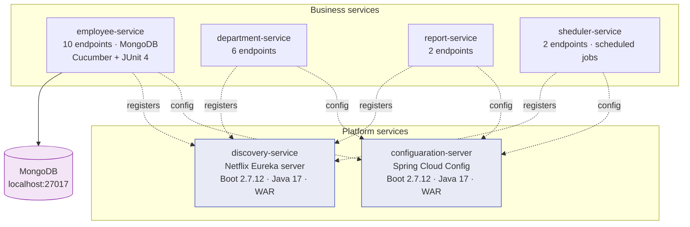
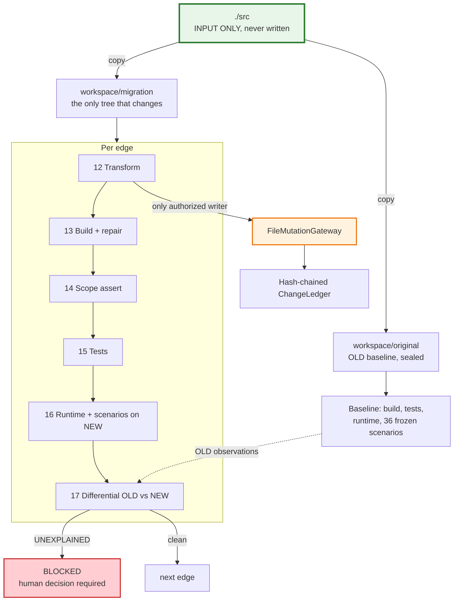
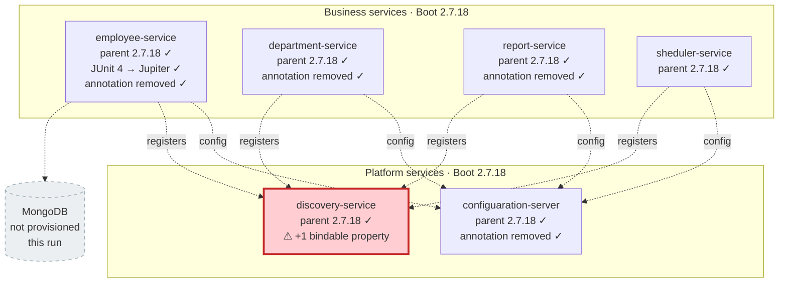

# Bootshift Migration Document

**Application:** six-module Spring Boot microservice estate (`./src`)
**Migration:** Spring Boot 2.7.12 / Java 17 → Spring Boot 3.5.16 / Java 21
**Run:** `RUN-01M26B99S7GWBDP1CSDV6Q5QV6` (pipeline run 2)
**Policy:** `policies/default/production-eol-exception.json`
**Status:** **INCOMPLETE — BLOCKED** at edge 2 of 8, awaiting a human decision
**Generated:** 2026-09-10

> This document describes what a real run of the harness actually did. It is not a plan and not a
> projection. Two of eight edges were attempted; one completed; the second was refused by the harness
> because it detected a behavioural difference it could not explain. Sections 8 onward say exactly
> what that means, and section 13 lists everything this run could not see.

---

## Table of contents

1. [Executive summary](#1-executive-summary)
2. [The application before migration](#2-the-application-before-migration)
3. [Architecture before](#3-architecture-before)
4. [How the migration was decided](#4-how-the-migration-was-decided)
5. [The migration path](#5-the-migration-path)
6. [How the harness works](#6-how-the-harness-works)
7. [Stage-by-stage record](#7-stage-by-stage-record)
8. [Edge 1 — test framework preparation](#8-edge-1--test-framework-preparation)
9. [Edge 2 — patch to 2.7.18, and why it stopped](#9-edge-2--patch-to-2718-and-why-it-stopped)
10. [Complete change inventory](#10-complete-change-inventory)
11. [Architecture now](#11-architecture-now)
12. [Behavioural validation](#12-behavioural-validation)
13. [What this run could not see](#13-what-this-run-could-not-see)
14. [What was not attempted](#14-what-was-not-attempted)
15. [How to resume](#15-how-to-resume)

---

## 1. Executive summary

| | |
|---|---|
| Edges planned | 8 |
| Edges completed | **1** (EDGE-1-PREP-TEST) |
| Edges attempted and blocked | **1** (EDGE-2-PATCH) |
| Edges never started | 6 |
| Source changes applied | **19**, all deterministic, all through the mutation gateway |
| Original `./src` modified | **No** — `f48b7888…8687b` before and after, byte-identical |
| Tests before / after | 12 / 12 — none deleted, disabled or weakened |
| Behavioural comparisons | 164 across two edges; 71 IDENTICAL, 92 NOT_COMPARED, **1 UNEXPLAINED** |
| Terminal state | `BLOCKED` — one unexplained behavioural difference on EDGE-2 |

The run stopped because it worked. On the patch edge from Spring Boot 2.7.12 to 2.7.18, the harness
compared the configuration surface of the `discovery-service` module before and after, found one
property that exists after and did not exist before, could not find a verified migration fact that
explains it, and refused to continue. Section 9 has the detail.

That refusal is the designed outcome for an unexplained difference. It is not a crash, and it is not
a failed migration — it is a migration paused at a decision that belongs to a human.

## 2. The application before migration

Six independently built Maven services, no aggregator POM, each producing a WAR.

| Module | Packaging | Role |
|---|---|---|
| `configuaration-server` | war | Spring Cloud Config server |
| `discovery-service` | war | Netflix Eureka server |
| `employee-service` | war | REST + MongoDB persistence, 10 endpoints, Cucumber suite |
| `department-service` | war | REST, 6 endpoints |
| `report-service` | war | REST, 2 endpoints |
| `sheduler-service` | war | scheduled jobs, 2 endpoints |

| Property | Value |
|---|---|
| Spring Boot | 2.7.12 |
| Spring Cloud | 2021.0.7 |
| Java | 17 |
| Build | Maven, per-module wrapper (`mvnw.cmd`), Maven 3.8.7 |
| Files | 99 across 6 modules |
| Graph | 839 nodes, 1852 edges, 239 symbols, attribution 0.6858 |
| Endpoints | 20 |
| Tests | 12, of which **2 fail before any migration change** |

The graph content hash `5b764c29af1e…` reproduced exactly between run 1 and run 2, which is the
evidence that analysis of this application is deterministic.

## 3. Architecture before



Everything in this diagram came from the application graph — the integration view resolved
`CONFIG_SERVER:spring-cloud-config`, `DISCOVERY:eureka` and `EXTERNAL_SYSTEM:mongodb` as real nodes,
not from reading configuration files by eye.

## 4. How the migration was decided

The landing target was resolved, not chosen.

**Spring Boot 3.5.16** was selected as `AUTO_HIGHEST_SAFE_SUPPORTED`. Boot 4.0 and 4.1 were eliminated
on a concrete constraint: this application uses Spring Cloud, and no GA Spring Cloud release train
targets those lines. A migration that lands where the ecosystem cannot follow is not a migration.

Every Boot 3.x line is past its OSS support date, so the run required an explicit policy
(`production-eol-exception.json`) that permits an EOL landing target *because the ecosystem offers no
compliant alternative*. The harness did not decide this quietly — it refuses to land on an EOL target
under the default production policy.

**Java 21** was selected as the landing runtime by `LTS_PREFERRED` over the JDKs actually installed on
this machine (`{17, 21}`), not from the JVM running the harness. Java is then selected *per edge*:

| Edges | Java | Why |
|---|---|---|
| 1, 2, 3 | **17** | Boot 2.7 and 3.0 support 17; 21 is not supported by the 2.7 line |
| 4–8 | **21** | Boot 3.1+ supports 21, and 21 is the highest installed LTS |

The Spring Cloud train is version-locked to the Boot line at every step: 2021.0.9 → 2022.0.5 →
2023.0.5 → 2023.0.6 → 2024.0.3 → 2025.0.3.

## 5. The migration path

One major boundary separates 2.7 from 3.5, and the path crosses it with a dedicated edge. The stage
self-check that refuses a path with fewer boundary edges than majors crossed passed.

```mermaid
graph LR
    A["2.7.12<br/>Java 17"] -->|"EDGE-1<br/>PREPARATORY"| B["2.7.12<br/>tests modernised"]
    B -->|"EDGE-2<br/>PATCH"| C["2.7.18<br/>Java 17"]
    C -->|"EDGE-3<br/>MAJOR BOUNDARY"| D["3.0.13<br/>Java 17"]
    D -->|"EDGE-4<br/>MINOR"| E["3.1.12<br/>Java 21"]
    E -->|"EDGE-5"| F["3.2.12"]
    F -->|"EDGE-6"| G["3.3.13"]
    G -->|"EDGE-7"| H["3.4.13"]
    H -->|"EDGE-8<br/>LANDING"| I["3.5.16<br/>Java 21"]

    style B fill:#c8e6c9,stroke:#2e7d32,stroke-width:3px
    style C fill:#ffcdd2,stroke:#c62828,stroke-width:3px
    style D fill:#eceff1,stroke:#90a4ae,stroke-dasharray: 5 5
    style E fill:#eceff1,stroke:#90a4ae,stroke-dasharray: 5 5
    style F fill:#eceff1,stroke:#90a4ae,stroke-dasharray: 5 5
    style G fill:#eceff1,stroke:#90a4ae,stroke-dasharray: 5 5
    style H fill:#eceff1,stroke:#90a4ae,stroke-dasharray: 5 5
    style I fill:#eceff1,stroke:#90a4ae,stroke-dasharray: 5 5
```



Green = completed. Red = attempted and blocked. Grey dashed = never started.

Each edge carries its own facts, its own recipes and its own toolchain:

| Edge | Class | From → to | Java | Cloud train | Recipes | Facts in force | Coverage |
|---|---|---|---|---|---|---|---|
| EDGE-1-PREP-TEST | PREPARATORY | 2.7.12 → 2.7.12 | 17 | 2021.0.9 | 1 | 692 | 0.9697 |
| EDGE-2-PATCH | PATCH | 2.7.12 → 2.7.18 | 17 | 2021.0.9 | 4 | 1388 | 0.8220 |
| EDGE-3-MAJOR-3 | MAJOR_BOUNDARY | 2.7.18 → 3.0.13 | 17 | 2022.0.5 | **33** | 1682 | 0.6795 |
| EDGE-4-MINOR | MINOR | 3.0.13 → 3.1.12 | 21 | 2022.0.5 | 4 | 1551 | 0.7357 |
| EDGE-5-MINOR | MINOR | 3.1.12 → 3.2.12 | 21 | 2023.0.5 | 4 | 1420 | 0.8035 |
| EDGE-6-MINOR | MINOR | 3.2.12 → 3.3.13 | 21 | 2023.0.6 | 4 | 1459 | 0.7820 |
| EDGE-7-MINOR | MINOR | 3.3.13 → 3.4.13 | 21 | 2024.0.3 | 4 | 1578 | 0.7231 |
| EDGE-8-LANDING | LANDING | 3.4.13 → 3.5.16 | 21 | 2025.0.3 | 4 | 1576 | 0.7240 |

The boundary edge carries 33 recipes against 4 for every other edge, and the lowest deterministic
coverage. That is the Jakarta namespace migration showing up where it belongs.

*Coverage here means: of the facts in force on this edge, what fraction has a deterministic
transformation rule available. It is not a statement that the fact set is complete.*

## 6. How the harness works



Four rules govern everything above:

- `./src` is input only. All mutation happens in an external workspace.
- `FileMutationGateway` is the only component that writes migrated source. Every write produces a
  ledger entry with FILE_ID, before hash, after hash, provider, recipe and evidence references.
- A scenario becomes an oracle by being **executed** against the original application, never by being
  written.
- Unknown means UNKNOWN, unobserved means NOT_COMPARED, and unexplained blocks.

## 7. Stage-by-stage record

| # | Stage | Result | What it produced |
|---|---|---|---|
| 00 | Bootstrap | SUCCESS | Workspaces created; OSS license gate **PASSED**; no forbidden recipe estate loadable |
| 01 | Inventory | SUCCESS | 99 files across 6 modules; file registry sealed |
| 02 | Build resolution | SUCCESS | **Authoritative** Maven model; 962 dependencies, 0 unresolved; 9186 managed versions |
| 03 | Application graph | SUCCESS | 839 nodes / 1852 edges / 239 symbols; content hash `5b764c29af1e` |
| 04 | Baseline | SUCCESS | Sealed; old workspace matches original; 12 tests (2 pre-existing failures); 4/6 modules started |
| 05 | Compatibility | SUCCESS | Lifecycle and availability registry across the version space |
| 06 | Target resolution | SUCCESS | 3.5.16 / Java 21; 8-edge path; 1 major boundary crossed |
| 07 | Documentation | SUCCESS | 21 documents pinned by content hash |
| 08 | Knowledge | SUCCESS | 1691 facts, 1683 verified; 8 per-edge BOMs resolved |
| 09 | Impact | SUCCESS | 2072 findings; 502 DEFINITELY_AFFECTED, 4 POSSIBLY, 1566 UNAFFECTED; 27 affected files |
| 10 | Characterization | SUCCESS | 82 scenarios: **36 FROZEN** against the original, 46 declared unobservable |
| 11 | Plan | SUCCESS | 8 edges, each with its own facts, recipes, toolchain and depth |
| 12–17 | Edge 1 | SUCCESS | See section 8 |
| 12–16 | Edge 2 | SUCCESS | See section 9 |
| 17 | Edge 2 differential | **POLICY_BLOCK** | 1 unexplained behavioural difference |
| 18 | Approval | not reached | — |
| 19 | Evidence | not reached | — |
| 20 | Export | not reached | — |

Stages 18–20 did not run, so this run produced no sealed evidence manifest, no provenance graph and no
final coverage claim. Nothing was generated in their place.

## 8. Edge 1 — test framework preparation

**2.7.12 → 2.7.12, Java 17, no version change.** A preparatory edge exists to make the codebase
migratable before anything moves. Here it modernised the test framework so that later edges are
validated by a test runner that survives the Boot 3 boundary.

**3 changes, all `test.junit4-to-jupiter`, all in `employee-service`:**

| Change | File |
|---|---|
| CHANGE-000001 | `cucumberglue/CucumberConfig.java` |
| CHANGE-000002 | `cucumberglue/CucumberSteps.java` |
| CHANGE-000003 | `repository/EmployeeRepositoryTest.java` |

**Validation:**

| Check | Result |
|---|---|
| Build | Compiled in **1 round**, no repair needed |
| Toolchain | Frozen 17 → executed **17.0.20.1** → verified true |
| Scope assertion | **0 violations** — nothing changed outside the authorized file set |
| Tests | 12 total: **10 PASSED, 2 PRE_EXISTING_FAILURE** |
| Runtime | 4/6 modules started |
| Scenarios on NEW | 36 executed, 36 successful |
| Differential | **82 comparisons: 36 IDENTICAL, 46 NOT_COMPARED, 0 unexplained** |

Edge 1 completed all eight phases and was marked COMPLETE.

## 9. Edge 2 — patch to 2.7.18, and why it stopped

**2.7.12 → 2.7.18, Java 17, Spring Cloud 2021.0.7 → 2021.0.9.**

**16 changes across all six modules:**

| Recipe | Count | What it did |
|---|---|---|
| `maven.parent-version` | 6 | `spring-boot-starter-parent` 2.7.12 → 2.7.18, one per module |
| `maven.managed-version` | 6 | `spring-cloud-dependencies` 2021.0.7 → 2021.0.9, one per module |
| `java.remove-annotation` | 4 | Removed a redundant annotation from four application classes |

**Validation up to the point of refusal:**

| Check | Result |
|---|---|
| Build | Compiled in **1 round** |
| Toolchain | Frozen 17 → executed **17.0.20.1** → verified true |
| Scope assertion | **0 violations** |
| Tests | 12 total: **10 PASSED, 2 PRE_EXISTING_FAILURE** — identical to baseline |
| Runtime | 4/6 modules started, 268 bound properties |
| Scenarios on NEW | 36 executed, 36 successful |
| Differential | 82 comparisons: 35 IDENTICAL, 46 NOT_COMPARED, **1 UNEXPLAINED** |

### The blocking difference

```
Scenario   SCN-00047
Dimension  CONFIGURATION_BINDING
Module     discovery-service
Target     /actuator/configprops
Verdict    UNEXPLAINED
```

The `/actuator/configprops` response exposed **236** configuration property paths before the change
and **237** after. Exactly one path appeared and none disappeared:

```
+ spring.cloud.loadbalancer.callGetWithRequestOnDelegates
    (org.springframework.cloud.client.loadbalancer.LoadBalancerClientsProperties)
```

This is real. Moving the Spring Cloud train from 2021.0.9 alongside the Boot patch added a
configuration property to `LoadBalancerClientsProperties`, and the property is now bindable on a
module where it was not bindable before.

The harness classified it `UNEXPLAINED` rather than `EXPECTED` because neither channel could account
for it: no verified migration fact in the knowledge base names this property, and no human has
recorded a decision covering it. Under the production policy, an unexplained behavioural difference
blocks the edge.

### Why this was found at all

This comparison ran in the `CONFIGURATION_BINDING` dimension, which the edge plan did **not** list as
a required dimension for a patch edge — the comparison is flagged `plan_required_dimension: false`.

Until the repair pass described in [`judge-repair-pass.md`](judge-repair-pass.md), the differential
stage discarded every scenario whose dimension the plan had not named. It would have executed this
scenario against both sides, held both observations on disk, and compared neither. The patch edge
would have passed clean and the configuration-surface change would have travelled silently into the
Jakarta boundary edge.

The plan's dimension list now decides which dimensions an edge must *account for*. It no longer
decides which measurements are *looked at*.

### What a human has to decide

Someone with authority over this application has to answer one question: **is a new bindable
load-balancer property on the discovery service acceptable?** The likely answer is yes — it is an
additive property from a patch-level Spring Cloud bump with no configured value. But the harness
cannot make that call, and it will not manufacture a decision to unblock itself. Section 15 says how
to record a real one.

## 10. Complete change inventory

19 changes, every one deterministic (`BOOTSHIFT_DETERMINISTIC` provider, version 1.0.0), every one
`APPLIED`, every one through the gateway with a before hash, an after hash and a patch reference. **No
AI-proposed change was applied in this run.**

| # | Edge | Recipe | File |
|---|---|---|---|
| 1 | EDGE-1 | `test.junit4-to-jupiter` | `employee-service/…/cucumberglue/CucumberConfig.java` |
| 2 | EDGE-1 | `test.junit4-to-jupiter` | `employee-service/…/cucumberglue/CucumberSteps.java` |
| 3 | EDGE-1 | `test.junit4-to-jupiter` | `employee-service/…/repository/EmployeeRepositoryTest.java` |
| 4 | EDGE-2 | `maven.parent-version` | `configuaration-server/pom.xml` |
| 5 | EDGE-2 | `maven.parent-version` | `department-service/pom.xml` |
| 6 | EDGE-2 | `maven.parent-version` | `discovery-service/pom.xml` |
| 7 | EDGE-2 | `maven.parent-version` | `employee-service/pom.xml` |
| 8 | EDGE-2 | `maven.parent-version` | `report-service/pom.xml` |
| 9 | EDGE-2 | `maven.parent-version` | `sheduler-service/pom.xml` |
| 10 | EDGE-2 | `maven.managed-version` | `configuaration-server/pom.xml` |
| 11 | EDGE-2 | `maven.managed-version` | `department-service/pom.xml` |
| 12 | EDGE-2 | `maven.managed-version` | `discovery-service/pom.xml` |
| 13 | EDGE-2 | `maven.managed-version` | `employee-service/pom.xml` |
| 14 | EDGE-2 | `maven.managed-version` | `report-service/pom.xml` |
| 15 | EDGE-2 | `maven.managed-version` | `sheduler-service/pom.xml` |
| 16 | EDGE-2 | `java.remove-annotation` | `configuaration-server/…/ConfiguarationServerApplication.java` |
| 17 | EDGE-2 | `java.remove-annotation` | `department-service/…/DepartmentServiceApplication.java` |
| 18 | EDGE-2 | `java.remove-annotation` | `employee-service/…/EmployeeServiceApplication.java` |
| 19 | EDGE-2 | `java.remove-annotation` | `report-service/…/ReportServiceApplication.java` |

The ledger is hash-chained: each entry carries the previous entry's hash, so removing or editing one
breaks every entry after it.

## 11. Architecture now

Structurally the estate is unchanged — no module was added, removed, split or merged. What moved is
the version floor and the test framework.



### Before and after, side by side

| | Before | Now | Target |
|---|---|---|---|
| Spring Boot | 2.7.12 | **2.7.18** | 3.5.16 |
| Spring Cloud | 2021.0.7 | **2021.0.9** | 2025.0.3 |
| Java | 17 | 17 | 21 |
| Namespace | `javax.*` | `javax.*` | `jakarta.*` |
| Test framework | JUnit 4 + Cucumber | **JUnit Jupiter + Cucumber** | Jupiter |
| Modules | 6 | 6 | 6 |
| Packaging | WAR | WAR | WAR |
| Endpoints | 20 | 20 | 20 |

**The Jakarta namespace migration has not happened.** It belongs to EDGE-3-MAJOR-3, which never
started. That edge carries 33 recipes — eight times any other edge — and it is where the substantial
risk in this migration lives. Nothing in this run should be read as evidence about it.

## 12. Behavioural validation

The unit of comparison is the executed scenario: the same request, issued against the original
application and against the migrated one, captured identically, normalized by the same versioned
policy, compared.

**36 scenarios** were frozen as oracles by executing them against the original application before any
change existed. All 36 executed successfully against the migrated application on both edges.

| Edge | Comparisons | IDENTICAL | NOT_COMPARED | UNEXPLAINED |
|---|---|---|---|---|
| EDGE-1-PREP-TEST | 82 | 36 | 46 | 0 |
| EDGE-2-PATCH | 82 | 35 | 46 | **1** |

Dimensions actually compared: `HTTP_API`, `SECURITY_AUTHORIZATION`, `SERIALIZATION`,
`CONFIGURATION_BINDING`, `CONTEXT_CAPABILITY`.

What is captured is structural, not literal — status code, content type, header names, security header
values, body shape, sorted body field paths. A response whose `timestamp` moved does not register; a
response that lost a field does.

The 46 NOT_COMPARED comparisons are honest gaps, not silent passes. Every one names why: the scenario
was declared unobservable because the datastore it needs could not be provisioned, or because its
module did not start.

## 13. What this run could not see

Stated plainly, because a validation result without its blind spots is a claim about a smaller
application than the one that exists.

**No container runtime.** Docker is installed on this machine but its engine was not running. The
harness probed the daemon rather than trusting the binary, found nothing answering, and recorded
`NO_OCI_RUNTIME`. Consequences:

- `PERSISTENCE_STATE`, `QUERY_RESULT` and `TRANSACTION_EFFECT` were never compared on either edge.
- 46 of 82 scenarios are `UNOBSERVABLE_WITH_EXPLICIT_GAP`.
- `employee-service` could not start (MongoDB connection refused after 30s).

**Two modules never ran.** `configuaration-server` fails to start outright — this is pre-existing and
was captured in the sealed baseline, not introduced by migration. `employee-service` needs MongoDB.
So runtime and scenario evidence covers **4 of 6 modules**.

**Two tests fail before any migration change.** They failed at baseline and after both edges, and are
classified `PRE_EXISTING_FAILURE`. They are application debt, not migration regressions — but they
also mean those two behaviours are unverified throughout.

**Coverage is unmeasurable for `employee-service`.** It produced no coverage report at baseline or on
either edge, so its coverage gate is reported as *not evaluated* rather than as passed.

**Symbol attribution is 0.6858, above the 0.6 policy floor but far from complete.** Roughly a third of
symbol relations could not be resolved to a declaring type, and impact findings derived from those
relations are capped at `POSSIBLY_AFFECTED` rather than promoted.

**Deterministic coverage is not migration completeness.** The 0.68–0.97 figures measure what fraction
of *known* facts have a transformation rule. They say nothing about facts the knowledge engine never
learned.

**No sealed evidence exists for this run.** Stages 18–20 never executed. There is no evidence
manifest, no mechanical evidence-level assignment, no provenance graph and no export.

## 14. What was not attempted

Six of eight edges never started, including every edge that carries real migration risk:

| Edge | Not attempted |
|---|---|
| EDGE-3-MAJOR-3 | **The Jakarta boundary.** 33 recipes. `javax.*` → `jakarta.*`, Boot 3.0 property renames, security configuration rewrite |
| EDGE-4-MINOR | 3.0 → 3.1, and the Java 17 → 21 toolchain change |
| EDGE-5 through EDGE-8 | 3.1 → 3.5.16, four further minor lines and the landing |

No claim in this document extends past EDGE-2-PATCH.

## 15. How to resume

The run is paused, not failed. The workspace, the ledger and every artifact are intact.

1. **Decide the difference.** A human with authority over `discovery-service` reviews SCN-00047 and
   determines whether a new bindable `spring.cloud.loadbalancer.callGetWithRequestOnDelegates`
   property is an acceptable, intentional consequence of the Spring Cloud 2021.0.7 → 2021.0.9 bump.

2. **Record the decision through the decision store**, with a real actor identity. The harness will
   not accept a decision it generated itself, and the LLM did not and cannot create one.

3. **Re-run.** The differential stage will find the recorded decision, reclassify SCN-00047 as
   `EXPECTED` with an approval reference, and continue to EDGE-3-MAJOR-3.

Alternatively, add a verified migration fact covering the property so the difference is explained by
evidence rather than by decision — the stronger of the two routes.

---

### Artifacts behind this document

| What | Where |
|---|---|
| Run 2 artifact plane | `output/` (stages 00–17) |
| Run 2 console log | `reports/pipeline-run-2.log` |
| Run 1 artifact plane (archived) | `output-run-1/` |
| Change ledger | `<workspace>/RUN-01M26B99S7GWBDP1CSDV6Q5QV6/change-ledger.jsonl` |
| Judge findings on run 1 | `reports/llm-judge-pass-1.md` |
| Repair pass | `reports/judge-repair-pass.md` |
| `./src` integrity | `reports/src-before-pipeline.sha256`, `reports/src-after-pipeline.sha256` |
